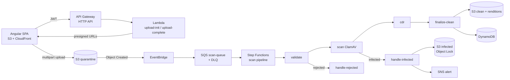
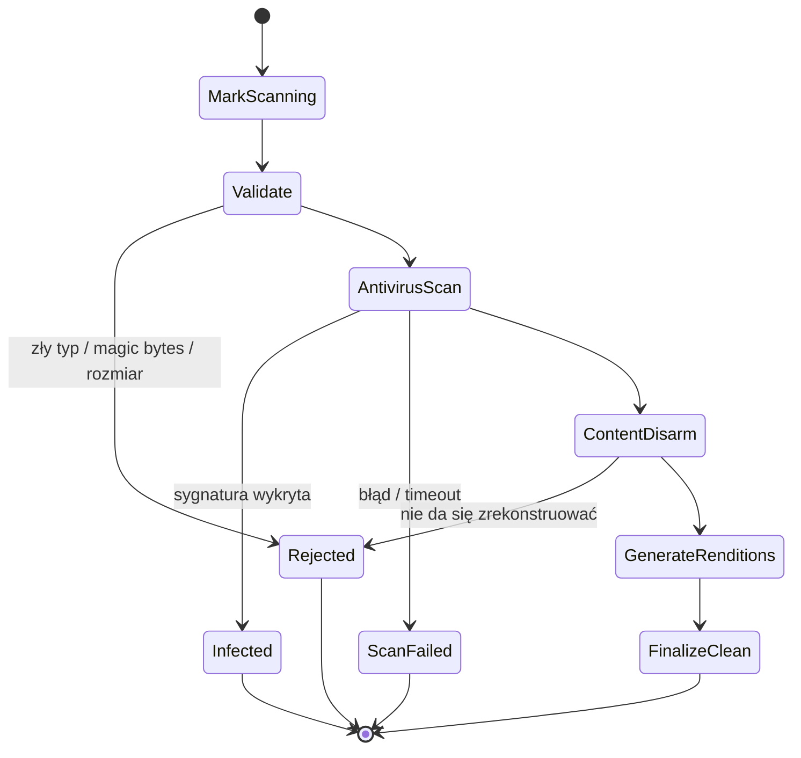
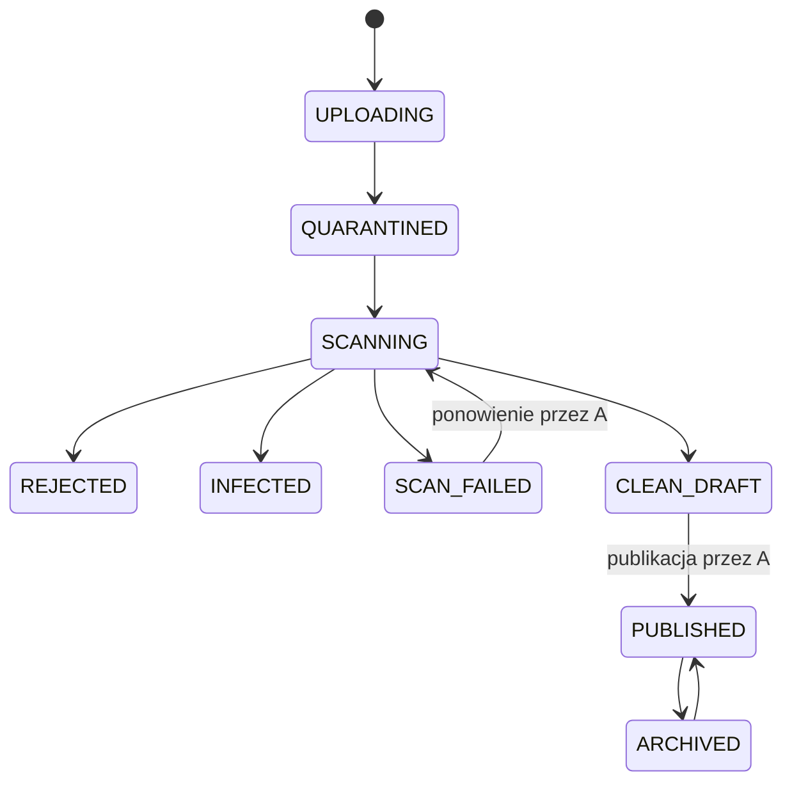

# Matchday DAM

**Digital Asset Management z wbudowanym antywirusem dla fikcyjnego klubu piłkarskiego**

Projekt edukacyjny i portfolio. System pozwala klubowi zbierać, weryfikować i udostępniać materiały medialne (zdjęcia meczowe, wideo, logotypy, materiały sponsorskie, dokumenty prasowe). Każdy plik od użytkownika jest traktowany jako niezaufany, dopóki pipeline bezpieczeństwa nie potwierdzi, że jest czysty.

> Klub jest fikcyjny (np. „KS Matchday"). Projekt nie używa nazw, herbów, zdjęć zawodników ani innych materiałów prawdziwych klubów. Zdjęcia testowe pochodzą z własnych zasobów lub banków z odpowiednią licencją.

---

## Spis treści

1. [Cele projektu](#1-cele-projektu)
2. [Stos technologiczny](#2-stos-technologiczny)
3. [Architektura](#3-architektura)
4. [Role użytkowników](#4-role-użytkowników)
5. [Cykl życia assetu](#5-cykl-życia-assetu)
6. [Struktura repozytorium](#6-struktura-repozytorium)
7. [Założenia](#7-założenia)
8. [Przeciwwskazania](#8-przeciwwskazania)
9. [Zasoby AWS](#9-zasoby-aws)
10. [Model IAM](#10-model-iam)
11. [Etapy wdrożenia](#11-etapy-wdrożenia)
12. [Scenariusze testów bezpieczeństwa](#12-scenariusze-testów-bezpieczeństwa)
13. [Koszty i Free Plan](#13-koszty-i-free-plan)
14. [Ryzyka i otwarte decyzje](#14-ryzyka-i-otwarte-decyzje)
15. [Planowane ADR](#15-planowane-adr)

---

## 1. Cele projektu

**Cele edukacyjne**

- Zaprojektować i zbudować backend w pełni serverless na AWS.
- Zrozumieć w praktyce IAM: role, role assumption, polityki tożsamościowe i zasobów, policy attachment, zasadę najmniejszych uprawnień.
- Zbudować architekturę sterowaną zdarzeniami (S3 → EventBridge → SQS → Step Functions → Lambda).
- Obsłużyć duże pliki bez przepuszczania ich przez API.
- Napisać funkcje Lambda w Ruście.
- Opisać całą infrastrukturę w Terraformie.

**Cele portfolio**

- Działający system z demonstrowalną ochroną przed złośliwymi plikami i metadanymi.
- Czytelne repozytorium: README, diagramy, threat model, ADR-y, testy, CI/CD.
- Możliwość odtworzenia całego środowiska jednym poleceniem.

**Poza zakresem**

- Obsługa produkcyjnego ruchu i terabajtów danych.
- Wielokontowa struktura AWS Organizations (opisana jako kierunek rozwoju).
- Aplikacje mobilne.

---

## 2. Stos technologiczny

| Warstwa | Technologia |
|---|---|
| Frontend | Angular 22 (standalone components, signals), Tailwind CSS, daisyUI |
| Hosting frontendu | S3 + CloudFront (+ AWS WAF opcjonalnie) |
| Uwierzytelnianie | Amazon Cognito User Pool (grupy A–D), OIDC + PKCE |
| API | Amazon API Gateway (HTTP API) z autoryzatorem JWT Cognito |
| Backend | AWS Lambda w Ruście (`provided.al2023`, `arm64`) |
| Skaner AV | ClamAV w Lambdzie jako obraz kontenera (ECR) |
| Orkiestracja | AWS Step Functions |
| Zdarzenia i kolejki | Amazon EventBridge, Amazon SQS (+ DLQ) |
| Powiadomienia | Amazon SNS |
| Dane | Amazon DynamoDB |
| Pliki | Amazon S3 (kwarantanna, clean, renditions, infected) |
| Infrastruktura jako kod | Terraform (lub OpenTofu) |
| CI/CD | GitHub Actions z OIDC do AWS |
| Jakość IaC | `terraform fmt`, `terraform validate`, `tflint`, Checkov lub Trivy |

**Kluczowe crate'y Rust**

| Crate | Zastosowanie |
|---|---|
| `lambda_runtime`, `aws_lambda_events` | Runtime i typy zdarzeń Lambda |
| `aws-sdk-s3`, `aws-sdk-dynamodb`, `aws-sdk-sfn`, `aws-sdk-sns` | Wybrane klienty AWS SDK (tylko potrzebne) |
| `tokio` | Asynchroniczny runtime |
| `serde`, `serde_json` | Serializacja |
| `tracing`, `tracing-subscriber` (JSON) | Logowanie strukturalne |
| `thiserror` | Typy błędów |
| `infer` | Rozpoznawanie typu pliku po magic bytes |
| `image` | Dekodowanie i ponowne kodowanie obrazów (CDR) |
| `ts-rs` | Generowanie typów TypeScript dla Angulara z modeli Rust |

Narzędzie do budowania Lambd: **Cargo Lambda** (`cargo lambda build --release --arm64 --output-format zip`).

---

## 3. Architektura

### 3.1 Przepływ główny



### 3.2 Pipeline skanowania (Step Functions)



### 3.3 Warstwy ochrony

| Warstwa | Przed czym chroni |
|---|---|
| Frontend (walidacja formularzy, limity) | Przypadkowe błędy uczciwych użytkowników. **Nie jest zabezpieczeniem.** |
| API (autoryzacja grup, JSON Schema dla metadanych) | Eskalacja uprawnień, wstrzykiwanie w metadane, nadmierne rozmiary |
| Presigned URL z serwerowym kluczem obiektu | Path traversal przez nazwę pliku, zapis poza kwarantannę |
| Polityka bucketu kwarantanny | Odczyt niezweryfikowanych plików przez kogokolwiek poza pipeline |
| Walidacja typu (magic bytes vs rozszerzenie vs MIME) | Podszywanie się pod dozwolony format, pliki poligloty |
| ClamAV | Znane złośliwe oprogramowanie |
| CDR (rekonstrukcja treści) | Złośliwe metadane EXIF/XMP/IPTC, ukryte dane, exploity parserów |
| CSP i sanityzacja Angulara | XSS przy wyświetlaniu metadanych |

### 3.4 Obsługa dużych plików

- Plik **nigdy** nie przechodzi przez API Gateway (limit payloadu 10 MB) ani przez pamięć Lambdy API.
- Upload multipart z przeglądarki bezpośrednio do S3 przez presigned URL-e dla każdej części.
- Części wysyłane równolegle z Web Workera, z sumami kontrolnymi (CRC32 lub SHA-256).
- Stan uploadu (`uploadId`, wysłane części) w IndexedDB i DynamoDB, co pozwala wznowić przerwany transfer.
- `CompleteMultipartUpload` wykonuje Lambda, która porównuje faktyczny rozmiar z zadeklarowanym.
- Reguła lifecycle `AbortIncompleteMultipartUpload` sprząta porzucone uploady.
- Limit w MVP: **1 GB** na plik. Powyżej tego progu docelowo skan na ECS Fargate (Lambda ma limity: 15 min, 10 GB RAM, 10 GB `/tmp`).
- Komunikaty w EventBridge, SQS i Step Functions zawierają tylko referencje (bucket, klucz, ID assetu), nigdy treść pliku.

---

## 4. Role użytkowników

| Grupa | Kto w klubie | Galeria | Upload | Pobieranie oryginału | Edycja / publikacja | Kwarantanna i incydenty |
|---|---|---|---|---|---|---|
| **A** – Admin | Media manager, dział komunikacji | Tak | Tak | Tak | Tak | Tak |
| **B** – Staff | Marketing, redakcja, social media | Tak | Nie | Tak | Nie | Nie |
| **C** – Contributor | Fotografowie meczowi, agencje | Tylko własne zgłoszenia | Tak | Nie | Nie | Nie |
| **D** – Viewer | Sponsorzy, partnerzy, media | Tylko podglądy z watermarkiem | Nie | Nie | Nie | Nie |

Zasady egzekwowania:

- Uprawnienia sprawdza **backend** (grupy z tokena JWT Cognito w każdej Lambdzie API). Ukrywanie przycisków w Angularze to wyłącznie UX.
- Grupa D nigdy nie dostaje URL-a do oryginału. Dostaje tylko rendition niskiej rozdzielczości z watermarkiem wygenerowany w pipeline.
- Linki do plików to krótko żyjące presigned URL-e (np. 5 minut), wydawane po sprawdzeniu uprawnień.

---

## 5. Cykl życia assetu

| Status | Znaczenie | Widoczny dla |
|---|---|---|
| `UPLOADING` | Trwa upload multipart | Uploader, A |
| `QUARANTINED` | Plik w kwarantannie, czeka na skan | Uploader, A |
| `SCANNING` | Pipeline w toku | Uploader, A |
| `REJECTED` | Odrzucony przez walidację (typ, rozmiar, CDR) | Uploader, A |
| `INFECTED` | Wykryte złośliwe oprogramowanie, incydent zgłoszony | A |
| `SCAN_FAILED` | Błąd lub timeout skanu, plik **nie** jest dopuszczony | A |
| `CLEAN_DRAFT` | Czysty, czeka na publikację przez A | Uploader, A |
| `PUBLISHED` | W galerii | A, B, D (wg zasad), uploader |
| `ARCHIVED` | Wycofany z galerii (np. wygasłe prawa wizerunkowe) | A |



Przejścia statusów realizowane są **warunkowymi zapisami** w DynamoDB (`ConditionExpression` na obecnym statusie). Gwarantuje to idempotencję przy wielokrotnym dostarczeniu zdarzenia i blokuje niedozwolone przejścia (np. `INFECTED` → `PUBLISHED`).

### Model danych (DynamoDB, tabela `assets`)

| Atrybut | Opis |
|---|---|
| `pk` | `ASSET#<uuid>` |
| `status` | Status z tabeli powyżej |
| `uploaderId` | `sub` z Cognito |
| `originalFilename` | Nazwa od użytkownika, tylko do wyświetlenia (po sanityzacji) |
| `detectedType`, `sizeBytes`, `sha256` | Ustalane przez pipeline, nie przez klienta |
| `title`, `tags` | Metadane od użytkownika po walidacji JSON Schema |
| `season`, `competition`, `matchId`, `playerIds` | Referencje do słowników, nie wolny tekst |
| `imageRightsUntil` | Data wygaśnięcia praw wizerunkowych |
| `embargoUntil` | Embargo (np. materiały transferowe przed ogłoszeniem) |
| `visibleToSponsors` | Lista sponsorów (grupa D), którzy mogą widzieć asset |
| `scanResult` | Wynik i wersja sygnatur ClamAV, czas skanu |
| `createdAt`, `updatedAt` | Znaczniki czasu |

Indeksy GSI: po `status` (kolejka publikacji, panel kwarantanny) oraz po `uploaderId` (widok „moje zgłoszenia" dla grupy C).

Osobna tabela `incidents` przechowuje zgłoszenia bezpieczeństwa: ID assetu, uploader, IP, wykryta sygnatura, czas, status obsługi.

---

## 6. Struktura repozytorium

```
matchday-dam/
├── README.md                     # opis, diagram, quick start, link do demo
├── docs/
│   ├── PROJEKT.md                # ten dokument
│   ├── threat-model.md           # zagrożenia i warstwy obrony
│   ├── adr/                      # Architecture Decision Records
│   │   ├── 0001-presigned-multipart-upload.md
│   │   ├── 0002-rust-for-lambdas.md
│   │   └── ...
│   └── diagrams/
├── frontend/                     # Angular 22 + Tailwind + daisyUI
│   ├── src/app/
│   │   ├── core/                 # auth, interceptory, guardy ról
│   │   ├── features/
│   │   │   ├── gallery/
│   │   │   ├── upload/           # upload multipart, Web Worker, wznawianie
│   │   │   ├── my-submissions/   # widok grupy C
│   │   │   └── admin/            # publikacja, kwarantanna, incydenty
│   │   └── shared/
│   │       └── generated-types/  # typy wygenerowane z Rusta (ts-rs), nie edytować
│   └── ...
├── lambdas/                      # cargo workspace
│   ├── Cargo.toml
│   ├── shared/                   # modele, statusy, błędy, klient DynamoDB, auth z JWT
│   ├── api/
│   │   ├── upload-init/
│   │   ├── upload-complete/
│   │   ├── assets-list/
│   │   ├── asset-download/
│   │   ├── asset-publish/
│   │   └── incidents-list/
│   └── pipeline/
│       ├── start-scan/           # konsument SQS, uruchamia Step Functions
│       ├── validate/
│       ├── scan/                 # + Dockerfile z ClamAV
│       ├── cdr/
│       ├── renditions/
│       ├── finalize-clean/
│       ├── handle-infected/
│       └── handle-rejected/
├── infra/
│   ├── bootstrap/                # bucket na stan Terraform, rola OIDC dla GitHub
│   ├── modules/
│   │   ├── auth/                 # Cognito, grupy
│   │   ├── storage/              # buckety, polityki, lifecycle, Object Lock
│   │   ├── messaging/            # EventBridge, SQS, DLQ, SNS
│   │   ├── pipeline/             # Step Functions, Lambdy pipeline'u, ECR
│   │   ├── api/                  # API Gateway, Lambdy API
│   │   ├── data/                 # DynamoDB
│   │   ├── frontend-hosting/     # S3 + CloudFront + nagłówki bezpieczeństwa
│   │   └── observability/        # alarmy CloudWatch, budżety
│   └── envs/
│       └── dev/                  # main.tf, variables.tf, backend.tf
├── tests/
│   ├── security-fixtures/        # pliki testowe ataków (patrz rozdział 12)
│   └── e2e/                      # testy end-to-end pipeline'u
├── justfile                      # build Lambd, obraz skanera, deploy
└── .github/workflows/
    ├── ci.yml                    # lint, testy, cargo, ng test, tflint, skan IaC
    ├── plan.yml                  # terraform plan jako komentarz w PR
    └── deploy.yml                # build + terraform apply po merge
```

---

## 7. Założenia

### 7.1 Architektoniczne

- Backend jest w pełni serverless. Nie ma serwerów działających stale.
- Każda funkcja Lambda robi jedną rzecz i ma własną rolę IAM.
- Komunikacja asynchroniczna przez zdarzenia i kolejki. Funkcje pipeline'u nie wywołują się nawzajem bezpośrednio.
- Step Functions odpowiada za kolejność kroków, ponowienia i obsługę błędów. Logika biznesowa jest w Lambdach.
- Wszystkie handlery są idempotentne.
- Typy danych mają jedno źródło prawdy (crate `shared`), z którego generowane są typy dla Angulara.
- Jedno konto AWS, jeden region (np. `eu-central-1`), jedno środowisko `dev`.

### 7.2 Bezpieczeństwa

- **Zero zaufania do danych od klienta.** Typ pliku, rozmiar i suma kontrolna są ustalane przez pipeline. Deklaracje klienta służą tylko do porównania.
- **Fail closed.** Każdy błąd, timeout lub niejednoznaczny wynik oznacza, że plik nie trafia do galerii (`SCAN_FAILED` lub `REJECTED`).
- Do galerii trafia **zrekonstruowana** wersja pliku (po CDR), nie oryginał od użytkownika.
- Klucze obiektów S3 generuje serwer (`quarantine/<uuid>`). Nazwa pliku od użytkownika to wyłącznie metadana.
- Metadane od użytkownika walidowane JSON Schema (długość, dozwolone znaki). Zawodnicy, mecze i sezony to referencje do słowników.
- Zasada najmniejszych uprawnień w IAM, wzmocniona politykami zasobów (bucket policy, queue policy).
- Wszystkie buckety: zablokowany dostęp publiczny, wymuszone TLS, szyfrowanie, wersjonowanie tam, gdzie ma sens.
- Zainfekowane pliki przechowywane z S3 Object Lock jako dowód incydentu.
- Frontend serwowany z nagłówkami CSP, HSTS, `X-Content-Type-Options`, `frame-ancestors 'none'`.
- Pobrane pliki serwowane z `Content-Disposition: attachment` i poprawnym `Content-Type`.
- Brak sekretów w repozytorium. CI łączy się z AWS przez OIDC.

### 7.3 Kosztowe

- Projekt mieści się w AWS Free Plan i limitach Always Free.
- Brak NAT Gateway, Lambdy poza VPC.
- Domyślne szyfrowanie S3 (SSE-S3) zamiast kluczy KMS zarządzanych przez klienta.
- Lifecycle: kwarantanna czyszczona po kilku dniach, niedokończone uploady przerywane.
- AWS Budgets z alertami mailowymi.
- `terraform destroy` jako awaryjny hamulec kosztów.

### 7.4 Domenowe

- Klub i wszystkie dane są fikcyjne.
- Asset może mieć datę wygaśnięcia praw wizerunkowych i datę embarga. Po ich przekroczeniu (lub przed nimi) asset nie jest widoczny dla grup B i D.
- Kategorie assetów: zdjęcia meczowe, zdjęcia treningowe, wideo, identyfikacja wizualna, materiały sponsorskie, dokumenty prasowe.

---

## 8. Przeciwwskazania

Rzeczy, których świadomie **nie robimy**, i powód.

| Nie robimy | Dlaczego |
|---|---|
| Upload pliku przez API Gateway lub Lambdę | Limit payloadu 10 MB, koszt, niepotrzebne obciążenie pamięci |
| Ufanie rozszerzeniu, nagłówkowi `Content-Type` lub MIME z przeglądarki | Trywialne do sfałszowania |
| Używanie nazwy pliku od użytkownika jako klucza S3 lub ścieżki | Path traversal, nadpisywanie plików, problemy z kodowaniem |
| Traktowanie walidacji w Angularze jako zabezpieczenia | Złośliwy użytkownik wywoła API bezpośrednio |
| Udostępnianie oryginałów z kwarantanny komukolwiek | Plik niezweryfikowany = potencjalnie złośliwy |
| Publikacja oryginału zamiast wersji po CDR | Oryginał może zawierać złośliwe metadane, których skaner nie wykrywa |
| Przepuszczanie pliku przy błędzie skanera („fail open") | Atakujący może celowo wywołać błąd, np. plikiem-bombą |
| Akceptowanie SVG, HTML, plików wykonywalnych, archiwów od grupy C | Wysokie ryzyko skryptów i bomb dekompresyjnych |
| Przekazywanie treści plików w zdarzeniach i kolejkach | Limity rozmiaru komunikatów, wyciek danych do logów |
| Logowanie pełnych metadanych od użytkownika | Wstrzykiwanie w logi, dane osobowe w CloudWatch |
| Polityki IAM z `"Action": "*"` lub `"Resource": "*"` (poza uzasadnionymi wyjątkami) | Łamie zasadę najmniejszych uprawnień |
| Jedna wspólna rola dla wielu Lambd | Kompromitacja jednej funkcji daje dostęp do wszystkiego |
| Klucze dostępowe AWS (access keys) w CI lub w repo | Ryzyko wycieku. Zamiast tego OIDC i role assumption |
| Używanie konta root do codziennej pracy | Brak możliwości ograniczenia uprawnień |
| Lambdy w VPC z NAT Gateway | Niepotrzebny stały koszt, brak korzyści w tej architekturze |
| Ręczne zmiany w konsoli AWS | Rozjazd ze stanem Terraform |
| Trzymanie stanu Terraform w repozytorium | Stan może zawierać dane wrażliwe, brak blokowania |
| AWS Organizations na etapie Free Planu | Dołączenie do organizacji kończy kredyty Free Tier |
| Pełne AWS SDK dla Rusta | Bardzo długi czas kompilacji. Dołączamy tylko potrzebne crate'y |
| `unsafe` w kodzie Rust parsującym pliki | Niweczy główny argument za Rustem w pipeline'ie |
| Materiały i marki prawdziwych klubów | Prawa autorskie, znaki towarowe, wizerunek |
| Otwarty upload w publicznym demo | Nadużycia i nieprzewidziane koszty |

---

## 9. Zasoby AWS

### Buckety S3

| Bucket | Zawartość | Kluczowa konfiguracja |
|---|---|---|
| `*-quarantine` | Pliki prosto od użytkowników | Odczyt tylko dla ról pipeline'u, lifecycle 3–7 dni, abort multipart po 2 dniach, CORS tylko dla domeny SPA i metody `PUT` |
| `*-clean` | Zrekonstruowane oryginały | Zapis tylko `finalize-clean`, odczyt przez presigned URL |
| `*-renditions` | Miniatury, podglądy z watermarkiem | Zapis tylko `renditions` |
| `*-infected` | Zainfekowane pliki | Object Lock (tryb governance w dev), zapis tylko `handle-infected`, odczyt tylko admin bezpieczeństwa |
| `*-frontend` | Zbudowana aplikacja Angular | Dostęp tylko przez CloudFront (Origin Access Control) |
| `*-tfstate` | Stan Terraform | Wersjonowanie, szyfrowanie, `use_lockfile` |

### Pozostałe

| Zasób | Rola |
|---|---|
| Cognito User Pool + grupy `admin`, `staff`, `contributor`, `viewer` | Logowanie, grupy w tokenie JWT |
| API Gateway HTTP API + autoryzator JWT | Wejście dla SPA, throttling |
| EventBridge (reguła na zdarzenia S3 z kwarantanny) | Przekazanie zdarzenia do kolejki |
| EventBridge (reguły na zdarzenia domenowe `asset.infected`, `asset.published`) | Powiadomienia, rozszerzalność |
| EventBridge Scheduler | Cykliczne zadania (np. archiwizacja po wygaśnięciu praw) |
| SQS `scan-queue` + `scan-dlq` | Bufor, ponowienia, martwe komunikaty |
| Step Functions `scan-pipeline` | Orkiestracja kroków |
| ECR `scanner` | Obraz Lambdy z ClamAV |
| DynamoDB `assets`, `incidents`, `uploads` | Dane |
| SNS `security-alerts` | Powiadomienia o incydentach |
| CloudWatch (logi, alarmy na DLQ, błędy, czas skanu) | Obserwowalność |
| AWS Budgets | Kontrola kosztów |
| CloudFront + nagłówki bezpieczeństwa | Hosting SPA |

---

## 10. Model IAM

### 10.1 Role

| Rola | Kto ją przyjmuje (trust policy) | Najważniejsze uprawnienia |
|---|---|---|
| `dam-upload-init` | `lambda.amazonaws.com` | `s3:PutObject` (presign) w `quarantine/*`, zapis do `uploads` |
| `dam-upload-complete` | `lambda.amazonaws.com` | `s3:CompleteMultipartUpload`, `s3:GetObjectAttributes` w kwarantannie, zapis do `assets` |
| `dam-assets-read` | `lambda.amazonaws.com` | Odczyt `assets`, `s3:GetObject` w `clean` i `renditions` (presign) |
| `dam-asset-publish` | `lambda.amazonaws.com` | Warunkowy zapis statusu w `assets`, `events:PutEvents` |
| `dam-start-scan` | `lambda.amazonaws.com` | Konsumpcja SQS, `states:StartExecution` |
| `dam-validate` | `lambda.amazonaws.com` | `s3:GetObject` w kwarantannie |
| `dam-scan` | `lambda.amazonaws.com` | `s3:GetObject` w kwarantannie |
| `dam-cdr` | `lambda.amazonaws.com` | Odczyt z kwarantanny, zapis tymczasowy w `clean/staging/*` |
| `dam-finalize-clean` | `lambda.amazonaws.com` | Zapis w `clean`, aktualizacja `assets` |
| `dam-handle-infected` | `lambda.amazonaws.com` | Odczyt z kwarantanny, zapis w `infected`, zapis w `incidents`, `sns:Publish` |
| `dam-scan-pipeline` | `states.amazonaws.com` | `lambda:InvokeFunction` tylko dla funkcji pipeline'u |
| `dam-eventbridge-to-sqs` | (polityka kolejki, nie rola) | `sqs:SendMessage` z warunkiem `aws:SourceArn` reguły |
| `dam-github-deploy` | GitHub OIDC (`token.actions.githubusercontent.com`) z warunkiem na repo i gałąź | Uprawnienia do deployu, ograniczone permission boundary |
| `dam-github-plan` | GitHub OIDC, dowolny PR z repo | Tylko odczyt (do `terraform plan`) |

### 10.2 Zasady

- Każda rola ma **trust policy** wskazującą jeden konkretny principal, z warunkiem `aws:SourceAccount` lub `aws:SourceArn` tam, gdzie to możliwe.
- Uprawnienia definiowane jako `aws_iam_policy` (customer managed) i przypinane przez `aws_iam_role_policy_attachment`. Polityki inline tylko wyjątkowo.
- Dokumenty polityk pisane przez `data "aws_iam_policy_document"`, nie jako wklejony JSON.
- Do logów: AWS managed `AWSLambdaBasicExecutionRole`.
- **Polityki zasobów jako druga linia obrony:**
  - bucket kwarantanny: `Deny` na `s3:GetObject` dla wszystkich ról poza `dam-validate`, `dam-scan`, `dam-cdr`, `dam-handle-infected`,
  - wszystkie buckety: `Deny` przy `aws:SecureTransport = false`,
  - kolejka SQS: `sqs:SendMessage` tylko z konkretnej reguły EventBridge.
- Role deployu z **permission boundary**, które uniemożliwia im nadanie sobie lub innym rolom szerszych uprawnień.
- Grupy Cognito **nie** dostają bezpośredniego dostępu do S3. Dostęp do plików wyłącznie przez presigned URL-e po autoryzacji w Lambdzie.

---

## 11. Etapy wdrożenia

Każdy etap kończy się działającym, wdrożonym systemem. Po etapie 1 projekt nadaje się już do pokazania.

### Etap 0 — Fundamenty

**Cel:** konto, repozytorium i pipeline CI/CD gotowe, zanim powstanie pierwsza funkcja biznesowa.

- [ ] Założenie konta AWS na Free Plan
- [ ] MFA na koncie root, codzienna praca przez IAM Identity Center (lub użytkownika IAM z MFA)
- [ ] AWS Budgets z alertami (np. 5 USD i 20 USD)
- [ ] Monorepo z katalogami `frontend/`, `lambdas/`, `infra/`, `docs/`
- [ ] `infra/bootstrap/`: bucket na stan Terraform, dostawca OIDC GitHub, role `dam-github-plan` i `dam-github-deploy` z permission boundary
- [ ] `infra/envs/dev/` z backendem S3 (`use_lockfile = true`)
- [ ] Cargo workspace z crate'em `shared` i funkcją „hello world" w Ruście
- [ ] Wdrożenie funkcji „hello world" przez Terraform (`provided.al2023`, `arm64`)
- [ ] `justfile` z poleceniami `build`, `deploy`, `destroy`
- [ ] CI: `cargo fmt`, `cargo clippy`, `cargo test`, `ng lint`, `ng test`, `terraform fmt -check`, `terraform validate`, `tflint`, Checkov lub Trivy
- [ ] Workflow `plan.yml` komentujący PR wynikiem `terraform plan`

**Gotowe, gdy:** merge do `main` automatycznie wdraża funkcję w Ruście przez GitHub Actions bez żadnych kluczy dostępowych w repozytorium.

### Etap 1 — Rdzeń

**Cel:** pełny przepływ od uploadu do galerii z antywirusem.

- [x] Cognito User Pool, grupy A–D, konta testowe dla każdej grupy
- [x] Hosting frontendu: S3 + CloudFront z Origin Access Control
- [x] Angular: logowanie (OIDC + PKCE), guardy tras według grup, interceptor JWT
- [x] API Gateway HTTP API z autoryzatorem JWT
- [x] Moduł `storage`: buckety `quarantine`, `clean`, `infected` z politykami, lifecycle i CORS
- [x] Lambdy `upload-init` i `upload-complete` (presigned URL-e dla części, weryfikacja rozmiaru)
- [x] Angular: upload multipart w Web Workerze, postęp, równoległe części, wznawianie z IndexedDB
- [x] Tabela DynamoDB `assets` z warunkowymi przejściami statusów
- [x] EventBridge → SQS (+ DLQ) → `start-scan` (w etapie 1 SQS wywołuje bezpośrednio Lambdę `scan`, ADR 0014)
- [x] Obraz kontenera ze skanerem ClamAV w ECR, Lambda `scan`
- [x] Mechanizm aktualizacji sygnatur ClamAV (przebudowa obrazu w CI lub zaplanowana aktualizacja do S3)
- [x] Ścieżka czysta: kopiowanie do `clean`, status `CLEAN_DRAFT`
- [x] Ścieżka zainfekowana: przeniesienie do `infected`, status `INFECTED`, mail przez SNS
- [x] Angular: galeria, „moje zgłoszenia" (C), publikacja (A), pobieranie przez presigned URL (A, B)
- [x] Generowanie typów TypeScript z Rusta (`ts-rs`) w buildzie

**Gotowe, gdy:** plik testowy EICAR wgrany przez użytkownika grupy C ląduje w `infected`, a admin dostaje maila. Zwykłe zdjęcie po publikacji przez A jest widoczne i do pobrania dla B.

### Etap 2 — Bezpieczeństwo w głąb

**Cel:** ochrona przed tym, czego antywirus nie wykrywa.

- [x] Step Functions `scan-pipeline` zastępuje bezpośrednie wywołanie skanera
- [x] Lambda `validate`: magic bytes (`infer`), whitelista typów, porównanie z deklaracją, limit rozmiaru i wymiarów obrazu
- [x] Lambda `cdr`: dekodowanie i ponowne kodowanie obrazów, usunięcie metadanych, przepuszczenie whitelisty pól (autor, data, prawa autorskie)
- [x] Ochrona przed bombami dekompresyjnymi: sprawdzanie wymiarów przed pełnym dekodowaniem, limit pamięci
- [x] Lambda `renditions`: miniatury i podglądy z watermarkiem dla grupy D
- [x] Bucket `renditions`, grupa D widzi wyłącznie podglądy
- [ ] Walidacja metadanych JSON Schema w `upload-init` i przy edycji
- [x] Statusy `REJECTED` i `SCAN_FAILED` (fail closed), ponowienie skanu przez admina
- [x] Object Lock na buckecie `infected`
- [x] Tabela `incidents`, zdarzenie `asset.infected` w EventBridge
- [ ] Nagłówki bezpieczeństwa w CloudFront (CSP, HSTS, `X-Content-Type-Options`, `frame-ancestors`)
- [ ] Katalog `tests/security-fixtures/` i testy z rozdziału 12
- [ ] Testy IAM: próby niedozwolonego dostępu kończą się `AccessDenied`
- [ ] Dokument `docs/threat-model.md`

**Gotowe, gdy:** wszystkie scenariusze z rozdziału 12 przechodzą automatycznie w CI lub w teście e2e na środowisku `dev`.

### Etap 3 — Domena i dopracowanie

**Cel:** funkcje, które sprawiają, że to DAM dla klubu, a nie ogólny upload plików.

- [ ] Słowniki: zawodnicy, sezony, rozgrywki, mecze, sponsorzy
- [ ] Filtrowanie galerii po sezonie, meczu, zawodniku, kategorii (indeksy GSI w DynamoDB)
- [ ] Prawa wizerunkowe i embargo: EventBridge Scheduler archiwizuje lub ukrywa assety po terminie
- [ ] Widoczność dla wybranych sponsorów (grupa D)
- [ ] Panel admina: kwarantanna, incydenty, kolejka publikacji
- [ ] Alarmy CloudWatch: komunikaty w DLQ, błędy Lambd, czas skanu, nieudane wykonania Step Functions
- [ ] Retencja logów CloudWatch (np. 14 dni)
- [ ] Opcjonalnie: ścieżka ECS Fargate dla plików powyżej 1 GB

**Gotowe, gdy:** asset z wygasłymi prawami wizerunkowymi sam znika z galerii grupy D, a alarm na DLQ wysyła powiadomienie.

### Etap 4 — Portfolio

**Cel:** projekt czytelny dla rekrutera w 5 minut.

- [ ] README: opis, diagram, stos, quick start, link do demo i nagrania
- [ ] Komplet ADR (rozdział 15)
- [ ] Nagranie demo 2–3 min: upload, wykrycie EICAR, alert, CDR metadanych, publikacja, widok każdej grupy
- [ ] Publiczne demo (opcjonalnie): konta A, B, D; upload wyłączony lub mocno ograniczony (mały limit, throttling, kasowanie po 24 h)
- [ ] Test odtwarzalności: `terraform destroy` i pełne odtworzenie środowiska z CI
- [ ] Decyzja o koncie po 6 miesiącach (przejście na plan płatny z budżetem albo tylko nagranie)

**Gotowe, gdy:** osoba z zewnątrz może z README zrozumieć projekt, uruchomić demo i znaleźć uzasadnienie kluczowych decyzji.

---

## 12. Scenariusze testów bezpieczeństwa

| # | Scenariusz | Oczekiwany wynik |
|---|---|---|
| 1 | Plik testowy EICAR | `INFECTED`, plik w `infected`, alert SNS, wpis w `incidents` |
| 2 | JPEG z payloadem XSS w polu EXIF lub XMP | `CLEAN_DRAFT`, opublikowana wersja nie zawiera tego pola |
| 3 | SVG z `<script>` | `REJECTED` (typ spoza whitelisty) |
| 4 | Plik wykonywalny ze zmienionym rozszerzeniem `.jpg` | `REJECTED` (magic bytes niezgodne z deklaracją) |
| 5 | Plik poliglot (np. poprawny GIF i jednocześnie HTML) | Po CDR tylko poprawny obraz bez dodatkowej treści |
| 6 | Bomba dekompresyjna (obraz o ogromnych zadeklarowanych wymiarach) | `REJECTED` przed pełnym dekodowaniem |
| 7 | Nazwa pliku `../../etc/passwd.jpg` | Klucz S3 to UUID, nazwa wyświetlana po sanityzacji |
| 8 | Tytuł assetu z `<script>alert(1)</script>` | Odrzucony przez JSON Schema lub wyświetlony jako tekst |
| 9 | Użytkownik C wywołuje API publikacji | `403` |
| 10 | Użytkownik D prosi o link do oryginału | `403` |
| 11 | Zadeklarowany rozmiar 1 MB, faktyczny znacznie większy | `upload-complete` odrzuca, obiekt usunięty |
| 12 | Upload na inny klucz niż wskazany w presigned URL | Błąd podpisu S3 |
| 13 | Podwójne dostarczenie zdarzenia S3 | Jedno wykonanie pipeline'u (idempotencja) |
| 14 | Timeout lub błąd skanera | `SCAN_FAILED`, plik niedostępny w galerii |
| 15 | Rola `dam-asset-publish` próbuje czytać z kwarantanny | `AccessDenied` (bucket policy) |
| 16 | Bezpośrednie wywołanie API bez tokena lub z tokenem innej puli | `401` |

> Plik EICAR to standardowy, nieszkodliwy ciąg znaków stworzony do testowania antywirusów. Jest wykrywany przez wszystkie popularne skanery.

---

## 13. Koszty i Free Plan

- Nowe konta (od 15 lipca 2025) dostają Free Plan: do 200 USD kredytów, ważny do 6 miesięcy lub do wyczerpania kredytów. Po tym czasie konto trzeba przenieść na plan płatny, inaczej zostanie zamknięte.
- Usługi z limitami Always Free (m.in. Lambda, DynamoDB, SQS, SNS, CloudFront, Step Functions, Cognito) przy ruchu projektu edukacyjnego pozostają praktycznie darmowe także po okresie Free Planu.
- Z kredytów płacimy głównie za: S3 (storage i żądania), API Gateway, ECR.

**Na co uważać**

| Pozycja | Ryzyko | Ograniczenie |
|---|---|---|
| Lambda ze skanerem ClamAV | Duża pamięć (rzędu 2–3 GB) i ładowanie bazy sygnatur przy cold starcie zużywają GB-sekundy | Monitorować czas skanu, rozsądny limit współbieżności |
| NAT Gateway | Stała opłata godzinowa | Nie używać |
| ECS Fargate, MediaConvert | Szybkie zużycie kredytów | Odłożyć do etapu 3 lub pominąć |
| GuardDuty Malware Protection | Opłata za skanowany GB | Własny ClamAV |
| OpenSearch | Stały koszt nawet w wersji serverless | Wyszukiwanie przez GSI w DynamoDB |
| Logi CloudWatch | Rosną bez retencji | Retencja 7–14 dni |
| KMS (klucze klienta) | Stała opłata za klucz | SSE-S3 |

---

## 14. Ryzyka i otwarte decyzje

| Temat | Ryzyko / pytanie | Kierunek |
|---|---|---|
| ClamAV w Lambdzie | Cold start (ładowanie bazy sygnatur) może trwać kilkadziesiąt sekund | Zaakceptować w MVP, zmierzyć i opisać w README |
| Aktualizacja sygnatur | Serwery aktualizacji ClamAV mają limity pobrań | Aktualizować rzadko i centralnie (CI lub zaplanowane zadanie do S3), nie przy każdym uruchomieniu |
| Czas kompilacji Rust | Wolna pętla developerska z AWS SDK | Tylko potrzebne crate'y SDK, cache w CI, `cargo lambda watch` lokalnie |
| Angular 22 i ekosystem | Zgodność wersji Tailwind, daisyUI i bibliotek OIDC | Sprawdzić przed startem etapu 1 |
| Logowanie | Managed login Cognito czy własny formularz | Managed login w MVP (mniej kodu, mniej ryzyka) |
| Wideo | Miniatury wideo wymagają `ffmpeg` w Lambdzie | Etap 3 lub pominięte; w MVP tylko obrazy (PDF bez CDR wyłączony, ADR 0007) |
| Koniec Free Planu | Konto zamknięte po 6 miesiącach | Zaplanować przejście na plan płatny lub poprzestać na nagraniu demo |
| Terraform vs OpenTofu | Różnice licencyjne | Dowolny wybór, kod HCL zgodny |

---

## 15. Planowane ADR

| Nr | Decyzja |
|---|---|
| 0001 | Upload multipart przez presigned URL-e zamiast przez API |
| 0002 | Rust jako język Lambd (bezpieczeństwo pamięci przy parsowaniu niezaufanych plików) |
| 0003 | Terraform jako IaC |
| 0004 | SQS między EventBridge a pipeline'em (bufor, ponowienia, DLQ) |
| 0005 | Step Functions do orkiestracji pipeline'u |
| 0006 | Własny ClamAV zamiast GuardDuty Malware Protection |
| 0007 | CDR i publikacja zrekonstruowanej wersji zamiast oryginału |
| 0008 | Fail closed przy błędach skanu |
| 0009 | DynamoDB jako baza danych i warunkowe przejścia statusów |
| 0010 | Dostęp do plików wyłącznie przez presigned URL-e, bez dostępu grup Cognito do S3 |
| 0011 | Limit 1 GB w MVP, Fargate jako ścieżka dla większych plików |
| 0012 | Jedno konto AWS w fazie Free Planu |
