# Architektura chmurowa — Matchday DAM

Ten dokument opisuje, **co dokładnie działa w AWS i co się dzieje z plikiem od chwili wybrania go w przeglądarce do pobrania z galerii**. Opis odpowiada stanowi kodu w repozytorium (środowisko `dev`, region `eu-central-1`). Szczegóły poszczególnych funkcji: [`lambdas/README.md`](../lambdas/README.md); moduły Terraform: [`infra/README.md`](../infra/README.md); kontrakt API: [`docs/api.md`](api.md); model zagrożeń: [`docs/threat-model.md`](threat-model.md).

Spis treści:

1. [Obraz całości](#1-obraz-całości)
2. [Zasada nadrzędna: zero zaufania do pliku](#2-zasada-nadrzędna-zero-zaufania-do-pliku)
3. [Komponenty AWS](#3-komponenty-aws)
4. [Przepływ 1: logowanie](#4-przepływ-1-logowanie)
5. [Przepływ 2: upload pliku](#5-przepływ-2-upload-pliku)
6. [Przepływ 3: pipeline bezpieczeństwa (Step Functions)](#6-przepływ-3-pipeline-bezpieczeństwa-step-functions)
7. [Przepływ 4: publikacja, galeria, pobieranie](#7-przepływ-4-publikacja-galeria-pobieranie)
8. [Przepływ 5: incydent (plik zainfekowany)](#8-przepływ-5-incydent-plik-zainfekowany)
9. [Przepływ 6: ponowienie skanu i usuwanie](#9-przepływ-6-ponowienie-skanu-i-usuwanie)
10. [Cykl życia assetu (statusy)](#10-cykl-życia-assetu-statusy)
11. [Buckety S3 i klucze obiektów](#11-buckety-s3-i-klucze-obiektów)
12. [Tabele DynamoDB](#12-tabele-dynamodb)
13. [Role IAM: kto co może](#13-role-iam-kto-co-może)
14. [Grupy użytkowników A–D](#14-grupy-użytkowników-ad)
15. [Logi, śledzenie i alerty](#15-logi-śledzenie-i-alerty)
16. [Limity i wartości graniczne](#16-limity-i-wartości-graniczne)
17. [CI/CD: jak kod trafia do AWS](#17-cicd-jak-kod-trafia-do-aws)
18. [Nazewnictwo zasobów](#18-nazewnictwo-zasobów)

---

## 1. Obraz całości

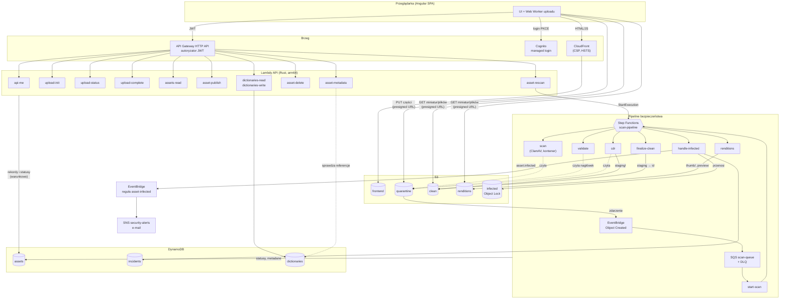

W skrócie:

- **Frontend** to statyczne pliki w prywatnym buckecie S3, serwowane wyłącznie przez CloudFront.
- **Tożsamość** zapewnia Cognito (grupy `admin`, `staff`, `contributor`, `viewer` = role A–D).
- **API** to HTTP API Gateway z autoryzatorem JWT; każda trasa ma własną Lambdę w Ruście z własną rolą IAM.
- **Pliki nigdy nie przechodzą przez API.** Przeglądarka wysyła części prosto do bucketu `quarantine` po presigned URL-ach, a pobiera pliki z `clean`/`renditions` też po presigned URL-ach (5 min).
- **Pipeline** uruchamia się sam: zdarzenie S3 → EventBridge → SQS → `start-scan` → Step Functions. Maszyna stanów woła kolejne Lambdy: skan ClamAV, walidację typu, rekonstrukcję obrazu (CDR), miniatury, finalizację.
- **Stan** całego systemu to rekord w tabeli `assets` (status + metadane). Każda zmiana statusu jest warunkowa.
- **Słowniki** klubu (zawodnicy, sezony, rozgrywki, mecze, sponsorzy) są w tabeli `dictionaries`; metadane assetów odwołują się do nich identyfikatorami (etap 3).

## 2. Zasada nadrzędna: zero zaufania do pliku

Wszystko, co przychodzi od użytkownika (plik, nazwa, deklarowany typ i rozmiar, tytuł), jest niezaufane, dopóki pipeline nie potwierdzi, że jest bezpieczne. Konsekwencje widać w każdej warstwie:

| Warstwa | Jak realizuje zasadę |
|---|---|
| Upload | Klucz S3 nadaje serwer (UUID), nazwa pliku służy tylko do wyświetlania. Obiekt w kwarantannie ma `Content-Type: application/octet-stream`, więc nawet przypadkiem nie zostanie zinterpretowany jako HTML. |
| Kwarantanna | Polityka bucketu blokuje odczyt wszystkim poza rolami pipeline'u. Żadna rola API nie czyta kwarantanny; nie ma do niej presigned GET. |
| Rozmiar | `upload-complete` liczy rozmiar z części zapisanych w S3 (`ListParts`), nie z deklaracji. Niezgodność = przerwanie uploadu i `REJECTED`. |
| Typ | `validate` ustala typ z magic bytes i porównuje z deklaracją. Tylko JPEG, PNG, WebP. |
| Treść | `cdr` dekoduje obraz do pikseli i koduje od nowa. Do galerii trafia **wyłącznie zrekonstruowana kopia**, oryginał jest usuwany. |
| Błędy | Fail closed: każdy błąd, timeout, nieznana odpowiedź skanera kończy się `SCAN_FAILED`, a plik nie trafia do galerii (ADR 0008). |
| Dostęp | Grupy sprawdza każda Lambda (nie tylko UI). Grupa D (sponsorzy) dostaje tylko podgląd ze znakiem wodnym. |

## 3. Komponenty AWS

| Usługa | Zasób (dev) | Rola w systemie | Terraform |
|---|---|---|---|
| CloudFront | dystrybucja SPA | Serwuje frontend, dodaje nagłówki bezpieczeństwa (CSP, HSTS, `X-Frame-Options`, `Permissions-Policy`), routing SPA (403/404 → `index.html`) | `modules/frontend-hosting` |
| S3 | `matchday-dam-dev-frontend-<konto>` | Pliki Angulara + `config.json` (adresy Cognito/API) | `modules/frontend-hosting` |
| Cognito | user pool `matchday-dam-dev` | Logowanie (managed login, PKCE), grupy A–D, tokeny 60 min | `modules/auth` |
| API Gateway | HTTP API `matchday-dam-dev` | Trasy REST, autoryzator JWT, CORS, throttling 10 req/s (burst 20), logi dostępu | `modules/http-api` |
| Lambda | 19 funkcji `matchday-dam-dev-*` | Logika API i kroki pipeline'u | `modules/rust-lambda`, `modules/scanner` |
| S3 | `quarantine`, `clean`, `renditions`, `infected` | Pliki na kolejnych etapach weryfikacji | `modules/storage` |
| EventBridge | reguła `quarantine-object-created` | Nowy obiekt w kwarantannie → kolejka | `modules/scanner` |
| SQS | `scan-queue` + `scan-dlq` | Bufor zdarzeń, ponowienia, martwe komunikaty po 3 próbach | `modules/scanner` |
| Step Functions | `matchday-dam-dev-scan-pipeline` (Standard, JSONata) | Orkiestracja kroków, ponowienia, ścieżki błędów | `modules/scanner/pipeline.tf` |
| ECR | `matchday-dam-dev-scanner` | Obraz kontenera Lambdy `scan` z ClamAV (3 ostatnie obrazy) | `modules/scanner` |
| DynamoDB | `assets`, `incidents`, `dictionaries` | Stan assetów, incydenty, słowniki klubu; on-demand, PITR | `modules/data` |
| EventBridge | reguła `asset-infected` | Zdarzenie domenowe → e-mail SNS | `modules/scanner/alerts.tf` |
| SNS | `security-alerts` | Alert e-mail o wykryciu malware | `modules/scanner/alerts.tf` |
| CloudWatch Logs | `/aws/lambda/*`, `/aws/apigateway/*`, `/aws/vendedlogs/states/*` | Logi JSON (14 dni) | wszystkie moduły |
| X-Ray | maszyna stanów | Śledzenie wykonań pipeline'u | `modules/scanner/pipeline.tf` |
| S3 | `access-logs` | Logi dostępu S3 i CloudFront | `modules/access-logs` |
| IAM | role `dam-*`, boundary `dam-permissions-boundary` | Osobna rola na funkcję, granica uprawnień | `bootstrap/`, moduły |
| Budgets | 5 USD i 20 USD | Alert kosztowy | `bootstrap/budgets.tf` |

## 4. Przepływ 1: logowanie

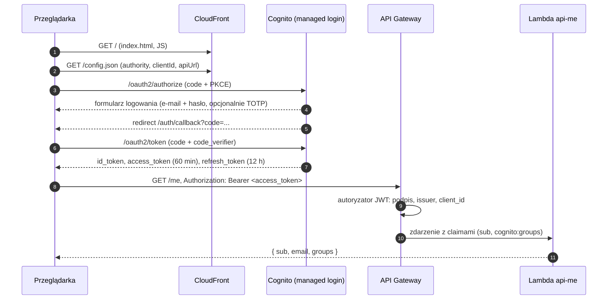

- Konta zakłada tylko administrator (`scripts/create-user.sh`); samodzielna rejestracja jest wyłączona.
- Klient SPA jest publiczny (bez sekretu), dozwolony jest wyłącznie przepływ `code` z PKCE. `ALLOW_USER_PASSWORD_AUTH` jest wyłączone.
- Autoryzator API Gateway odrzuca żądania bez tokenu lub z tokenem z innej puli (401) **zanim** zostanie wywołana jakakolwiek Lambda.
- Grupy z claimu `cognito:groups` frontend wykorzystuje tylko do ukrywania elementów UI. Uprawnienia egzekwuje każda Lambda osobno (`shared::auth`).

## 5. Przepływ 2: upload pliku

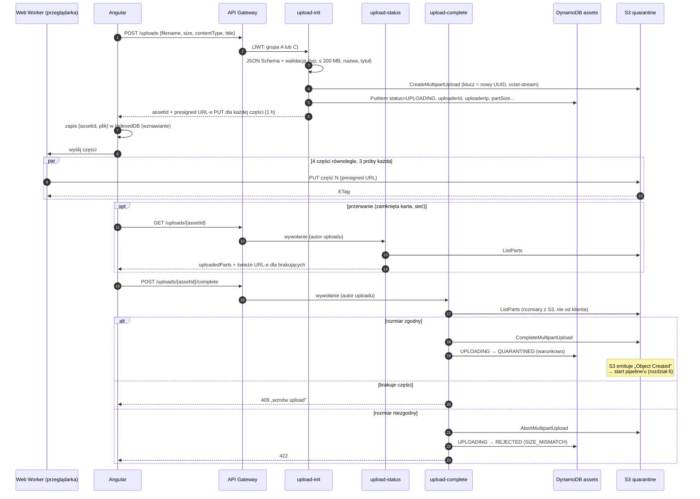

Najważniejsze szczegóły:

- **Podział na części**: domyślnie 8 MiB, więcej tylko gdy plik nie zmieściłby się w 10 000 części (`shared::upload::part_size_for`). Minimum S3 to 5 MiB.
- **Presigned URL** wiąże bucket, klucz, `uploadId` i numer części. Próba wysłania pod inny klucz kończy się `403 SignatureDoesNotMatch` (scenariusz 12).
- **Polityka bucketu** pozwala zapisywać do kwarantanny tylko rolom `dam-upload-init`, `dam-upload-status`, `dam-upload-complete`. Presigned URL działa z uprawnieniami roli, która go podpisała.
- **CORS kwarantanny** dopuszcza tylko `PUT` z originu SPA i odsłania nagłówek `ETag`.
- **Porzucone uploady** usuwa lifecycle S3 po 2 dniach (`abort_incomplete_multipart_upload`).
- Adres IP z API Gateway (`uploaderIp`) zapisujemy przy assecie, żeby w razie wykrycia malware trafił do incydentu.

## 6. Przepływ 3: pipeline bezpieczeństwa (Step Functions)

### 6.1 Od zdarzenia S3 do wykonania

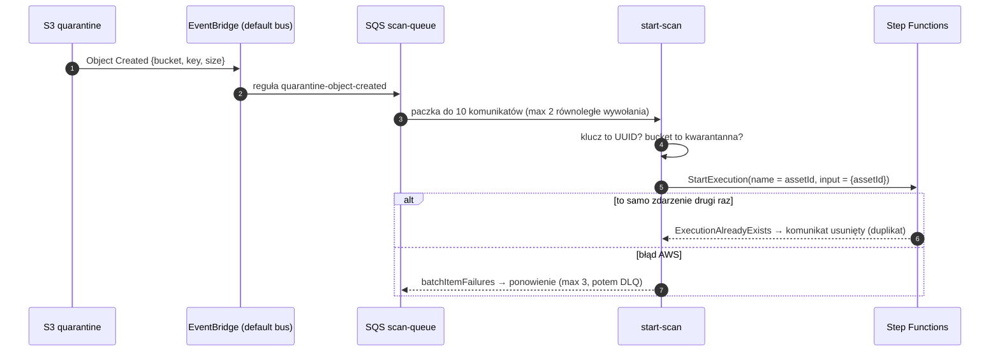

- Polityka kolejki: `SendMessage` tylko z tej jednej reguły EventBridge, tylko po TLS.
- **Idempotencja**: nazwa wykonania = ID assetu. Step Functions nie pozwoli uruchomić drugiego wykonania o tej samej nazwie (scenariusz 13), a dodatkowo pierwszy krok maszyny zmienia status warunkowo `QUARANTINED → SCANNING`.
- `maximum_concurrency = 2` ogranicza liczbę równoległych startów (koszty, limit konta).

### 6.2 Maszyna stanów `scan-pipeline`

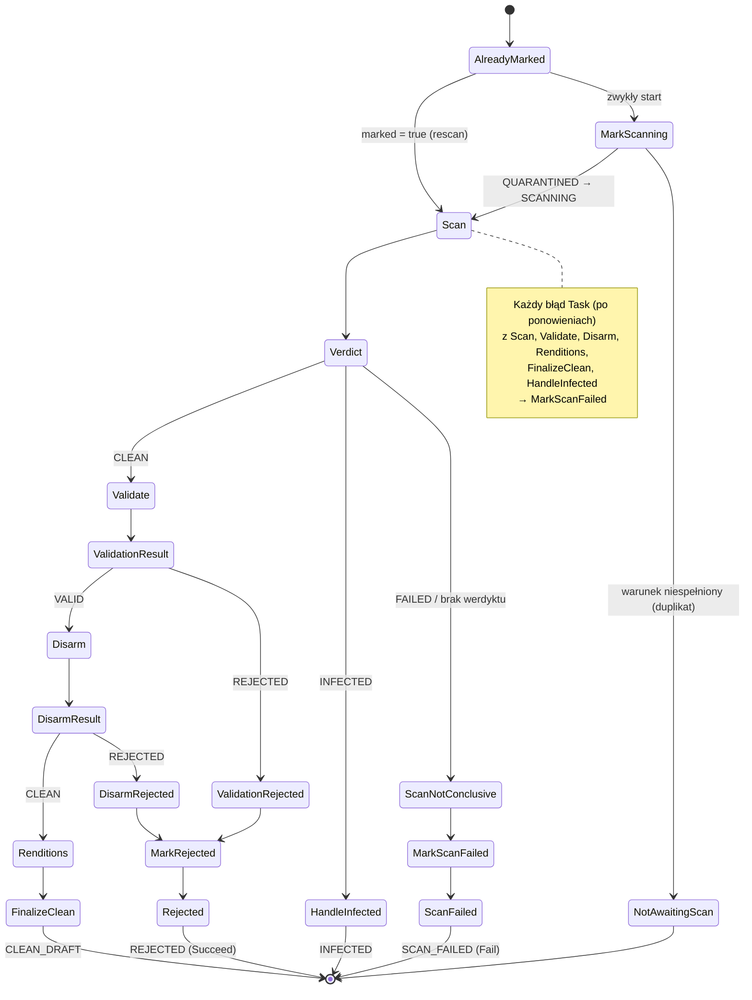

| Stan | Typ | Co robi | Wynik w danych wykonania |
|---|---|---|---|
| `AlreadyMarked` | Choice | Rescan od admina ma już status `SCANNING` (`marked: true`), więc pomija oznaczenie | — |
| `MarkScanning` | Task `dynamodb:updateItem` | `QUARANTINED → SCANNING` warunkowo (bez Lambdy) | wejście bez zmian |
| `Scan` | Task `lambda:invoke` → `scan` | Pobiera plik do `/tmp`, skanuje `clamd` | `scan: {verdict, engine, signature?/reason?}` |
| `Verdict` | Choice | `CLEAN` / `INFECTED` / reszta | — |
| `Validate` | Task → `validate` | Magic bytes, zgodność z deklaracją, rozmiar, wymiary z nagłówka | `validation: {result, detectedType, width, height, sizeBytes}` |
| `Disarm` | Task → `cdr` | Dekodowanie i ponowne kodowanie, whitelista EXIF, zapis do `clean/staging/<id>` | `disarm: {result, sizeBytes, sha256, metadata}` |
| `Renditions` | Task → `renditions` | Miniatura 400 px i podgląd 1200 px ze znakiem wodnym | `renditions: {thumbnailKey, previewKey}` |
| `FinalizeClean` | Task → `finalize-clean` | `staging/<id>` → `<id>`, usunięcie oryginału, `CLEAN_DRAFT` + metadane | `{assetId, status}` |
| `HandleInfected` | Task → `handle-infected` | Przeniesienie do `infected`, `INFECTED`, incydent, zdarzenie | `{assetId, status, incidentId}` |
| `MarkRejected` | Task `dynamodb:updateItem` | `SCANNING → REJECTED` + `rejectReason` | — |
| `MarkScanFailed` | Task `dynamodb:updateItem` | `SCANNING → SCAN_FAILED` + `scanError` | — |

Dane przekazywane między krokami to **wyłącznie referencje i wyniki** (ID, werdykt, typ, wymiary, hash), nigdy treść pliku. Kontrakty kroków są typami Rusta w `shared::pipeline` (`StepInput`, `ScanOutcome`, `ValidationOutcome`, `DisarmOutcome`, `RenditionsOutcome`).

**Ponowienia** (zdefiniowane w `pipeline.tf`):

| Polityka | Błędy | Próby | Odstęp |
|---|---|---|---|
| `lambda_retry` | błędy usługi Lambda (throttling, `ServiceException`) | 4 | 5 s × 2ⁿ + jitter |
| `step_retry` | `lambda_retry` + `States.TaskFailed` (błąd w kodzie kroku) | +2 | 10 s × 2ⁿ |
| `dynamo_retry` | throttling DynamoDB | 5 | 2 s × 2ⁿ |

`Scan` i `Disarm` nie ponawiają `States.TaskFailed`: skan trwa długo, a błąd dekodowania jest deterministyczny. Wszystkie kroki Lambd są idempotentne (przeniesienia S3 sprawdzają, czy cel już istnieje, zmiany statusu akceptują stan docelowy), więc ponowienie jest bezpieczne.

**Dlaczego REJECTED to Succeed, a SCAN_FAILED to Fail?** Odrzucenie przez walidację lub CDR to poprawny, oczekiwany wynik (plik jest zły). `SCAN_FAILED` oznacza, że system nie potrafił ocenić pliku: wykonanie kończy się błędem, widocznym w konsoli i metrykach Step Functions, a admin może ponowić skan.

### 6.3 Co dzieje się z plikiem w każdym kroku

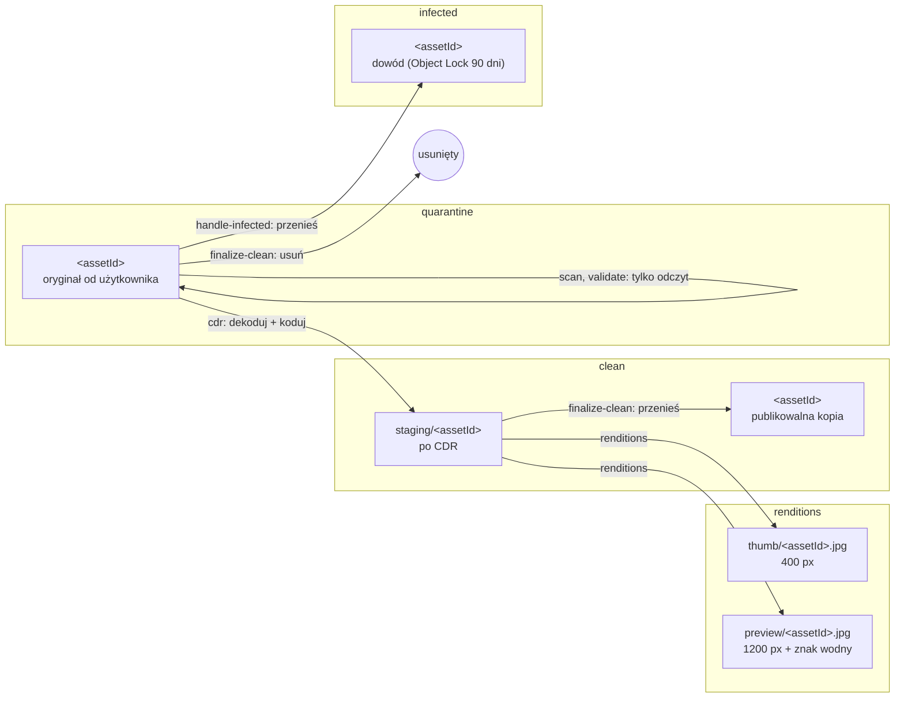

## 7. Przepływ 4: publikacja, galeria, pobieranie

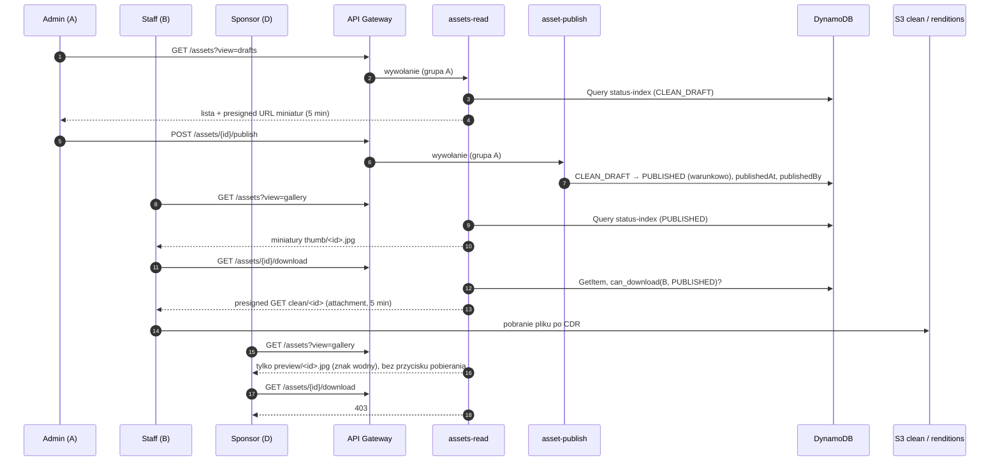

- Jedyną rolą API z prawem odczytu `clean` i `renditions` jest `dam-assets-read` (polityka bucketu + IAM). Linki podpisuje ta funkcja **po** sprawdzeniu grup, więc nikt nie dostanie linku do pliku, którego nie powinien widzieć.
- Presigned GET wymusza nagłówki odpowiedzi: `Content-Type` z wykrytego typu, `Content-Disposition` (`inline` dla podglądu, `attachment; filename="..."` dla pobrania, z bezpieczną nazwą ASCII) i `Cache-Control: private, no-store`.
- Listy są stronicowane po 50 elementów kursorem `<createdAt>.<assetId>`. Wartość klucza indeksu wynika z widoku, więc kursorem nie da się przełączyć na cudze dane.

## 8. Przepływ 5: incydent (plik zainfekowany)

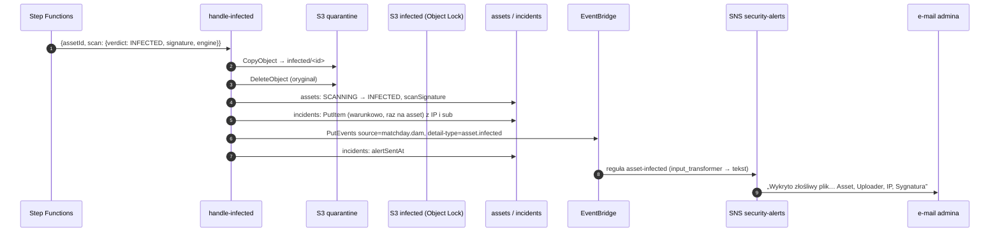

- Plik w `infected` jest chroniony **Object Lock w trybie GOVERNANCE przez 90 dni**; nikt poza rolą z `s3:BypassGovernanceRetention` (tylko deploy przy `terraform destroy`) go nie usunie. Odczytu z `infected` nie ma żadna rola.
- Zdarzenie i e-mail zawierają tylko referencje (ID, `sub`, IP, sygnaturę), bez nazwy pliku ani tytułu od użytkownika (rozdział 8 projektu: dane użytkownika nie trafiają do logów i powiadomień).
- Zdarzenie wychodzi **co najmniej raz**: `alertSentAt` zapisujemy po udanym `PutEvents`, więc ponowiony krok nie wyśle drugiego maila, a nieudany nie zgubi alertu.
- Autor uploadu (grupa C) widzi tylko status `REJECTED`, bez informacji o wykryciu.
- Kolejni odbiorcy (Slack, panel incydentów) to nowe reguły EventBridge bez zmiany kodu Lambdy.

## 9. Przepływ 6: ponowienie skanu i usuwanie

**Rescan** (`POST /assets/{id}/rescan`, tylko A):

1. `asset-rescan` zmienia status warunkowo `SCAN_FAILED → SCANNING`.
2. Startuje wykonanie o nazwie `<assetId>-retry-<millis>` z wejściem `{assetId, marked: true}`; stan `AlreadyMarked` pomija wtedy `MarkScanning`.
3. Jeśli start się nie uda, status wraca na `SCAN_FAILED` (asset nie utknie w `SCANNING`).
4. Plik musi jeszcze być w kwarantannie (lifecycle usuwa go po 7 dniach); jeśli go nie ma, skan znów skończy się `SCAN_FAILED`.

**Usuwanie** (`DELETE /assets/{id}`, tylko A):

1. `asset-delete` czyta status i sprawdza `can_delete`: dozwolone `CLEAN_DRAFT`, `PUBLISHED`, `ARCHIVED`, `REJECTED`, `SCAN_FAILED`. Assety w trakcie przetwarzania (`UPLOADING`, `QUARANTINED`, `SCANNING`) i `INFECTED` (dowód incydentu) → 409.
2. Usuwa obiekty: `clean/<id>`, `clean/staging/<id>`, `renditions/thumb/<id>.jpg`, `renditions/preview/<id>.jpg`, `quarantine/<id>`.
3. Usuwa rekord z `assets` **warunkowo na statusie odczytanym w kroku 1**; jeśli w międzyczasie się zmienił, rekord zostaje (409).
4. Buckety mają wersjonowanie, więc usunięte pliki można odzyskać przez 30 dni (`clean`) lub 7 dni (`renditions`) jako wersje nieaktualne.

**Słowniki i metadane** (etap 3, tylko A):

1. Słowniki edytuje się na stronie **Administracja → Słowniki** (`PUT`/`DELETE /dictionaries/{kind}/{id}`, Lambda `dictionaries-write`). Mecz musi wskazywać istniejący sezon i rozgrywki; sezonu ani rozgrywek używanych przez mecz nie da się usunąć.
2. Przycisk **Opisz** (kolejka publikacji, galeria) otwiera edytor metadanych → `PUT /assets/{id}/metadata` (Lambda `asset-metadata`): JSON Schema, sprawdzenie referencji w `dictionaries` (`BatchGetItem`), mecz uzupełnia sezon i rozgrywki, warunkowy `UpdateItem` tylko dla `CLEAN_DRAFT`/`PUBLISHED`/`ARCHIVED`.
3. Każda grupa czyta słowniki przez `GET /dictionaries` (bez sponsorów, poza A), a kafelki pokazują nazwy zamiast identyfikatorów.
4. Początkowe słowniki (fikcyjna kadra i terminarz) wgrywa krok deployu `scripts/seed-dictionaries.sh`, tylko gdy tabela jest pusta.

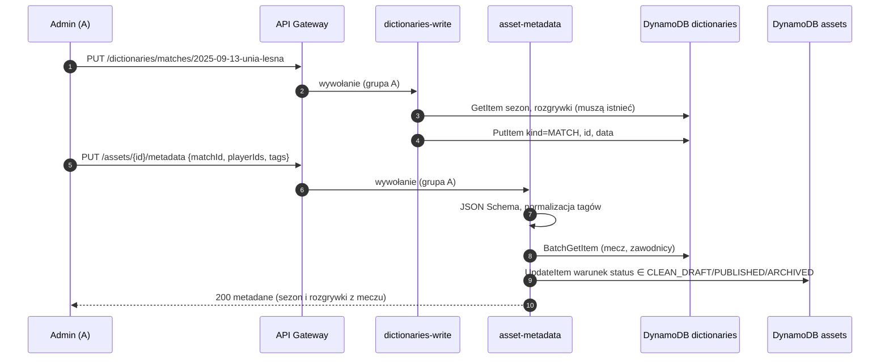

## 10. Cykl życia assetu (statusy)

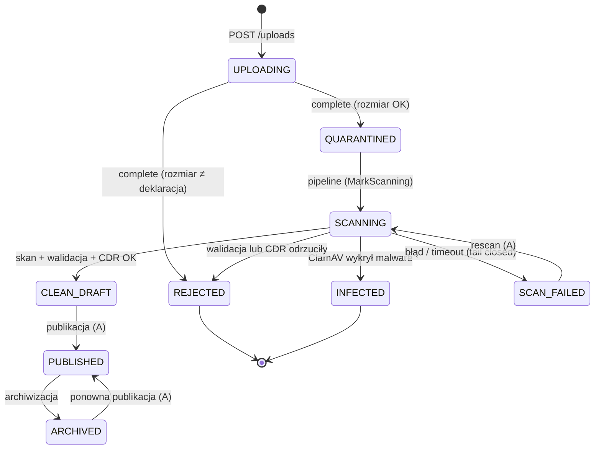

Źródło prawdy: `shared::status::AssetStatus::allowed_predecessors`. Każdy zapis statusu (w Lambdach i w stanach `dynamodb:updateItem` maszyny) to `UpdateItem` z `ConditionExpression: #status IN (dozwolone poprzedniki)`. Dzięki temu:

- nie da się opublikować pliku zainfekowanego ani będącego w kwarantannie,
- powtórzone zdarzenie nie zmienia stanu drugi raz,
- dwa równoległe procesy nie nadpiszą sobie statusu.

Widoczność statusów: autor (C) widzi `INFECTED` i `SCAN_FAILED` jako `REJECTED`, a `ARCHIVED` w ogóle (`shared::catalog::status_for_uploader`).

## 11. Buckety S3 i klucze obiektów

Wszystkie buckety: prywatne (Block Public Access), szyfrowanie SSE-S3, wersjonowanie, `BucketOwnerEnforced`, logi dostępu do bucketu `access-logs`, `Deny` dla połączeń bez TLS. Nazwa: `matchday-dam-dev-<nazwa>-<id konta>`.

| Bucket | Klucze | Kto czyta (polityka bucketu) | Kto zapisuje | Retencja |
|---|---|---|---|---|
| `quarantine` | `<assetId>` | `dam-scan`, `dam-validate`, `dam-cdr`, `dam-handle-infected` | `dam-upload-init`, `dam-upload-status`, `dam-upload-complete` (przez presigned URL) | 7 dni, wersje 1 dzień, uploady multipart 2 dni |
| `clean` | `<assetId>` (po CDR), `staging/<assetId>` (przed finalizacją) | `dam-assets-read`, `dam-finalize-clean`, `dam-renditions` | `dam-cdr` (tylko `staging/`), `dam-finalize-clean` | bez wygasania; wersje 30 dni; `staging/` 1 dzień |
| `renditions` | `thumb/<assetId>.jpg`, `preview/<assetId>.jpg` | `dam-assets-read` | `dam-renditions` | bez wygasania; wersje 7 dni |
| `infected` | `<assetId>` | nikt | `dam-handle-infected` | 90 dni, Object Lock GOVERNANCE 90 dni |
| `frontend` | pliki Angulara, `config.json` | CloudFront (OAC) | `dam-github-deploy` | — |
| `access-logs` | `s3/<bucket>/…`, `cloudfront/…` | — | usługi S3 i CloudFront | krótka retencja |

Polityka bucketu to **druga linia obrony**: nawet gdyby polityka IAM jakiejś roli była zbyt szeroka, `Deny` w buckecie blokuje odczyt/zapis wszystkim spoza listy (`aws:PrincipalArn`). Usuwanie obiektów kontrolują polityki IAM ról.

## 12. Tabele DynamoDB

Obie tabele: on-demand (`PAY_PER_REQUEST`), Point-in-Time Recovery, szyfrowanie kluczem AWS.

### `assets`

Klucz: `pk = "ASSET#<assetId>"`.

| Indeks | Klucz partycji | Klucz sortowania | Używa |
|---|---|---|---|
| `status-index` | `status` | `createdAt` | galeria (`PUBLISHED`), kolejka publikacji (`CLEAN_DRAFT`), nieudane skany (`SCAN_FAILED`) |
| `uploader-index` | `uploaderId` | `createdAt` | „moje zgłoszenia” |

Atrybuty i kto je zapisuje:

| Atrybut | Typ | Zapisuje | Znaczenie |
|---|---|---|---|
| `assetId` | S | upload-init | UUID v4 |
| `status` | S | wszyscy (warunkowo) | patrz rozdział 10 |
| `uploaderId` | S | upload-init | `sub` z Cognito |
| `uploaderIp` | S | upload-init | IP klienta (do incydentu) |
| `originalFilename` | S | upload-init | nazwa do wyświetlania (basename, bez znaków sterujących) |
| `title` | S | upload-init | opcjonalny tytuł |
| `declaredContentType`, `declaredSize` | S, N | upload-init | deklaracja klienta (tylko do porównania) |
| `uploadId`, `partSize`, `partCount` | S, N, N | upload-init | stan uploadu multipart |
| `createdAt`, `updatedAt` | N | upload-init / każda zmiana | ms od epoki |
| `sizeBytes` | N | upload-complete, finalize-clean | rozmiar (po CDR nadpisany rozmiarem kopii) |
| `rejectReason` | S | upload-complete, `MarkRejected` | np. `SIZE_MISMATCH`, `validate: typ … niezgodny…` |
| `scanVerdict`, `scanEngine`, `scannedAt` | S, S, N | handle-infected, finalize-clean, `MarkScanFailed` | wynik skanu |
| `scanSignature` | S | handle-infected | nazwa sygnatury ClamAV |
| `scanError` | S | `MarkScanFailed` | przyczyna błędu (max 500 znaków) |
| `detectedType`, `width`, `height` | S, N, N | finalize-clean | z magic bytes i nagłówka |
| `originalSizeBytes`, `sha256`, `disarmedAt` | N, S, N | finalize-clean | rozmiar oryginału, hash kopii po CDR |
| `exifArtist`, `exifCopyright`, `exifTakenAt` | S | finalize-clean | whitelista EXIF (po sanityzacji) |
| `hasRenditions` | BOOL | finalize-clean | są miniatura i podgląd |
| `publishedAt`, `publishedBy` | N, S | asset-publish | kto i kiedy opublikował |
| `category` | S | asset-metadata | `MATCH_PHOTO`, `TRAINING_PHOTO`, `VIDEO`, `BRAND_IDENTITY`, `SPONSOR_MATERIAL`, `PRESS_DOCUMENT` |
| `seasonId`, `competitionId`, `matchId` | S | asset-metadata | identyfikatory wpisów słowników (mecz wyznacza sezon i rozgrywki) |
| `playerIds`, `tags` | SS | asset-metadata | zbiory: zawodnicy (slugi), tagi (małymi literami) |
| `title` | S | upload-init, asset-metadata | tytuł (A może go zmienić) |
| `metadataUpdatedAt`, `metadataUpdatedBy` | N, S | asset-metadata | kto i kiedy opisał asset |

### `incidents`

Klucz: `incidentId` (= `assetId`, jeden incydent na asset). Atrybuty: `assetId`, `uploaderId`, `sourceIp`, `signature`, `engine`, `detectedAt`, `status` (`OPEN`), `alertSentAt`. Zapisuje wyłącznie `handle-infected`.

### `dictionaries`

Klucz partycji `kind` (`PLAYER`, `SEASON`, `COMPETITION`, `MATCH`, `SPONSOR`), klucz sortowania `id` (slug, np. `michal-kruk`). Atrybut `data` przechowuje wpis jako JSON (pola: [`docs/api.md`](api.md#put-dictionarieskindid)). Zapisuje `dictionaries-write` (A) i seed przy pierwszym deployu. Czyta `dictionaries-read` (`Scan`) i `asset-metadata` (`BatchGetItem`).

## 13. Role IAM: kto co może

Każda funkcja ma własną rolę `dam-<nazwa>` z polityką `dam-<nazwa>-main` (customer managed) i `AWSLambdaBasicExecutionRole` (logi). Każda rola ma permission boundary `dam-permissions-boundary`.

| Rola | S3 | DynamoDB | Inne |
|---|---|---|---|
| `dam-api-me` | — | — | — |
| `dam-upload-init` | `PutObject` quarantine/* | `PutItem` assets | — |
| `dam-upload-status` | `ListMultipartUploadParts`, `PutObject` quarantine/* | `GetItem` assets | — |
| `dam-upload-complete` | `ListMultipartUploadParts`, `PutObject`, `AbortMultipartUpload` quarantine/* | `GetItem`, `UpdateItem` assets | — |
| `dam-assets-read` | `GetObject` clean/*, renditions/* | `GetItem`, `Query` assets + oba indeksy | — |
| `dam-asset-publish` | — | `UpdateItem` assets | — |
| `dam-asset-rescan` | — | `UpdateItem` assets | `states:StartExecution` scan-pipeline |
| `dam-asset-delete` | `DeleteObject` clean/*, renditions/*, quarantine/* | `GetItem`, `DeleteItem` assets | — |
| `dam-asset-metadata` | — | `BatchGetItem` dictionaries, `UpdateItem` assets | — |
| `dam-dictionaries-read` | — | `Scan` dictionaries | — |
| `dam-dictionaries-write` | — | `GetItem`, `PutItem`, `DeleteItem`, `Query` dictionaries | — |
| `dam-start-scan` | — | — | SQS receive/delete, `states:StartExecution` |
| `dam-scan` | `GetObject` quarantine/* | — | — |
| `dam-validate` | `GetObject` quarantine/* | `GetItem` assets | — |
| `dam-cdr` | `GetObject` quarantine/*, `PutObject` clean/staging/* | — | — |
| `dam-renditions` | `GetObject` clean/staging/*, `PutObject` renditions/thumb/*, preview/* | — | — |
| `dam-finalize-clean` | `GetObject`/`DeleteObject` clean/staging/*, `PutObject` clean/*, `ListBucket` clean, `DeleteObject` quarantine/* | `GetItem`, `UpdateItem` assets | — |
| `dam-handle-infected` | `GetObject`/`DeleteObject` quarantine/*, `PutObject` infected/*, `ListBucket` infected | `GetItem`, `UpdateItem` assets; `GetItem`, `PutItem`, `UpdateItem` incidents | `events:PutEvents` (tylko `source = matchday.dam`) |
| `dam-scan-pipeline` (Step Functions) | — | `UpdateItem` assets | `lambda:InvokeFunction` 6 kroków, logi, X-Ray |
| `dam-hello-world` | — | — | — |
| `dam-github-plan` | odczyt | odczyt | `ReadOnlyAccess` + lock stanu |
| `dam-github-deploy` | wszystko w granicach boundary | | PowerUserAccess + ograniczony IAM |

Permission boundary (`infra/bootstrap/permissions_boundary.tf`) gwarantuje, że:

1. role działają tylko na usługach używanych w projekcie i tylko w `eu-central-1` (+ `us-east-1` dla usług globalnych),
2. rola może tworzyć inne role wyłącznie z tym samym boundary (nie da się „uciec” przez rolę bez ograniczeń),
3. nikt z boundary nie zmieni boundary ani ról `dam-github-*`,
4. bucket stanu Terraform jest chroniony przed usunięciem i zmianą polityki.

Uzasadnienie: [ADR 0013](adr/0013-github-oidc-deploy-roles.md).

## 14. Grupy użytkowników A–D

| Grupa (Cognito) | Kto | Galeria | Pobieranie oryginału | Upload | Moje zgłoszenia | Panel admina (publikacja, rescan, usuwanie, metadane, słowniki) | Słowniki (odczyt) |
|---|---|---|---|---|---|---|---|
| A `admin` | dział komunikacji | miniatury | `PUBLISHED`, `CLEAN_DRAFT` | ✅ | ✅ (wszystkie statusy) | ✅ | ✅ ze sponsorami |
| B `staff` | marketing, redakcja | miniatury | `PUBLISHED` | — | — | — | ✅ bez sponsorów |
| C `contributor` | fotografowie, agencje | — | — | ✅ | ✅ (`INFECTED`/`SCAN_FAILED` jako `REJECTED`) | — | ✅ bez sponsorów |
| D `viewer` | sponsorzy, media | **tylko podgląd ze znakiem wodnym** | — | — | — | — | ✅ bez sponsorów |

Reguły są w `shared::catalog` (`AssetView::allowed_groups`, `can_download`, `can_delete`, `preview_source`, `status_for_uploader`) i w stałych `UPLOADERS` Lambd uploadu. Frontend powiela je tylko w strażnikach tras (`requireGroups`) i w ukrywaniu przycisków.

## 15. Logi, śledzenie i alerty

| Źródło | Gdzie | Zawartość |
|---|---|---|
| Lambdy | `/aws/lambda/matchday-dam-dev-<funkcja>` (14 dni) | JSON z `tracing`: `asset_id`, `sub`, wynik kroku. Bez treści pliku, nazw i tytułów. Błędy 500 logowane ze szczegółami, klient dostaje tylko „Internal error”. |
| API Gateway | `/aws/apigateway/matchday-dam-dev` | `requestId`, IP, trasa, status, latencja, `sub`, błąd autoryzatora/integracji. Bez nagłówków i ciał. |
| Step Functions | `/aws/vendedlogs/states/matchday-dam-dev-scan-pipeline` | Poziom `ALL` z danymi wykonania (tylko referencje i wyniki) + X-Ray |
| S3, CloudFront | bucket `access-logs` | kto pobierał co i kiedy |
| Alert bezpieczeństwa | SNS `security-alerts` → e-mail | wykrycie malware (rozdział 8) |
| Koszty | AWS Budgets | e-mail przy 5 i 20 USD/miesiąc |

Diagnoza typowych sytuacji:

- **Asset utknął w `QUARANTINED`**: sprawdź kolejkę `scan-dlq` i logi `start-scan`.
- **Asset w `SCAN_FAILED`**: atrybut `scanError` w `assets` + wykonanie `scan-pipeline` o nazwie = assetId w konsoli Step Functions (widać każdy krok z wejściem i wyjściem).
- **Asset w `REJECTED`**: atrybut `rejectReason` (np. `validate: typ image/png niezgodny z deklaracją image/jpeg`).

Alarmy CloudWatch (DLQ, błędy Lambd, nieudane wykonania) są zaplanowane na etap 3.

## 16. Limity i wartości graniczne

| Limit | Wartość | Gdzie |
|---|---|---|
| Rozmiar pliku | 200 MB | `shared::upload::MAX_UPLOAD_BYTES`, JSON Schema, `validate`, `cdr` |
| Dozwolone typy | `image/jpeg`, `image/png`, `image/webp` | `shared::upload::ALLOWED_CONTENT_TYPES` |
| Część multipart | 8 MiB (min 5 MiB, max 10 000 części) | `shared::upload` |
| Równoległość uploadu | 4 części, 3 próby każda (backoff 1 s, 2 s, 4 s) | `frontend/src/app/core/upload` |
| Ważność URL części | 1 h | `shared::multipart::PART_URL_TTL` |
| Ważność URL pobrania/podglądu | 5 min | `assets-read::FILE_URL_TTL` |
| Wymiary obrazu | ≤ 20 000 px na bok, ≤ 100 MP | `shared::pipeline::limits` |
| Pamięć dekodera | 1 GB | `cdr`, `renditions` |
| Tytuł / nazwa pliku | 120 / 200 znaków po sanityzacji | `shared::upload` |
| Strona listy | 50 | `assets-read::PAGE_SIZE` |
| Throttling API | 10 req/s, burst 20 | `modules/http-api` |
| Tokeny | access/id 60 min, refresh 12 h | `modules/auth` |
| Timeout skanu | 600 s (Lambda), 720 s (stan) | `modules/scanner` |
| Pamięć skanera | 3008 MB, `/tmp` 2 GB | `modules/scanner` |
| Równoległe starty pipeline'u | 2 | `aws_lambda_event_source_mapping.start_scan` |
| Ponowienia komunikatu SQS | 3, potem DLQ (14 dni) | `modules/scanner` |
| Kwarantanna | 7 dni | `modules/storage` |
| Dowody incydentów | 90 dni (Object Lock) | `modules/storage` |

## 17. CI/CD: jak kod trafia do AWS

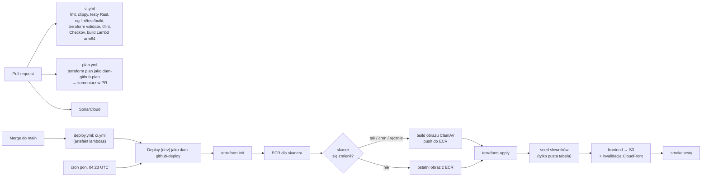

- GitHub Actions łączy się z AWS **wyłącznie przez OIDC** (role `dam-github-plan`, `dam-github-deploy`), w repozytorium nie ma kluczy.
- Lambdy budowane są raz w CI (`cargo lambda build --release --arm64`), deploy pobiera gotowy artefakt.
- Obraz skanera przebudowuje się, gdy zmienił się kod `lambdas/pipeline/scan`, `lambdas/shared` lub `Cargo.lock`, oraz co tydzień (świeże sygnatury ClamAV; baza jest wbudowana w obraz).
- Testy bezpieczeństwa na żywym środowisku: workflow „E2E (rozdział 12)” (`tests/e2e/run.sh`, ręcznie).

## 18. Nazewnictwo zasobów

| Wzorzec | Przykład |
|---|---|
| Prefiks zasobów | `matchday-dam-dev` (`<projekt>-<środowisko>`) |
| Funkcja Lambda | `matchday-dam-dev-upload-init`, `matchday-dam-dev-scan` |
| Rola funkcji | `dam-upload-init` (bez środowiska: jedno konto, ADR 0012) |
| Polityka funkcji | `dam-upload-init-main` |
| Bucket | `matchday-dam-dev-quarantine-891048843451` |
| Tabela | `matchday-dam-dev-assets` |
| Maszyna stanów | `matchday-dam-dev-scan-pipeline` |
| Wykonanie | `<assetId>` albo `<assetId>-retry-<ms>` |
| Artefakt Lambdy | `lambdas/target/lambda/<crate>/bootstrap.zip`, crate `api-upload-init`, `pipeline-cdr` |
