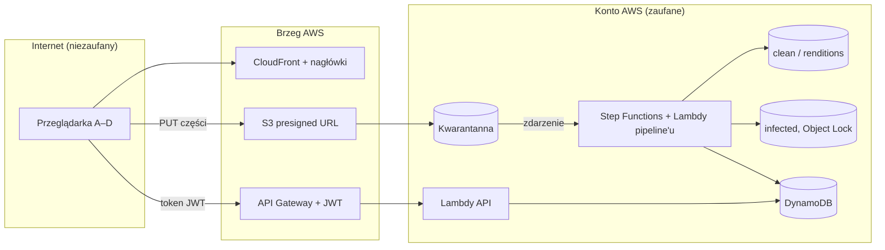

# Model zagrożeń — Matchday DAM

Model obejmuje środowisko `dev` po etapie 2 i części 1 etapu 3 (słowniki, metadane): upload plików przez grupę C, pipeline skanowania (Step Functions), galerię i pobieranie. Metoda: granice zaufania i STRIDE dla każdego przepływu danych, z odwołaniem do zabezpieczeń w kodzie i scenariuszy testowych z rozdziału 12 dokumentu projektu (`tests/e2e/run.sh`).

## Co chronimy

| Zasób | Dlaczego ważny |
|---|---|
| Opublikowane materiały i oryginały | Wartość biznesowa klubu, prawa wizerunkowe, embarga |
| Przeglądarki użytkowników A–D | Złośliwy plik lub metadane mogą wykonać kod (XSS) w sesji admina |
| Tokeny Cognito | Przejęcie tokenu A to publikacja dowolnych treści |
| Infrastruktura AWS i koszty | Nadużycie uploadu lub pipeline'u generuje koszty |
| Dowody incydentów | Potrzebne do wyjaśnienia ataku (kto, kiedy, skąd) |

## Granice zaufania

Wszystko, co przychodzi z przeglądarki (plik, nazwa, typ, tytuł, rozmiar), jest niezaufane do czasu przejścia przez pipeline. Przeglądarka grupy D jest traktowana jak strona trzecia: nie dostaje nigdy oryginału.

## STRIDE

| # | Zagrożenie | Przykład | Zabezpieczenie | Test |
|---|---|---|---|---|
| S1 | Podszycie się pod użytkownika | Token z innej puli Cognito, brak tokenu | Autoryzator JWT HTTP API (issuer, audience), krótkie tokeny (60 min) | sc. 16 |
| S2 | Podszycie się pod zdarzenie S3 | Ręczne wysłanie komunikatu do kolejki skanowania | Polityka kolejki: `SendMessage` tylko z reguły EventBridge; klucz musi być UUID | — |
| T1 | Złośliwa treść w pliku | Znany malware, EICAR | ClamAV (`scan`), fail closed, `INFECTED` + incydent | sc. 1 |
| T2 | Treść, której AV nie wykrywa | XSS w EXIF/XMP, poliglota GIF/PNG + HTML | CDR: dekodowanie i ponowne kodowanie obrazu (ADR 0007) | sc. 2, 5 |
| T3 | Podszycie się pod dozwolony typ | `.exe` lub SVG jako `.jpg` | Magic bytes (`validate`), whitelista JPEG/PNG/WebP, zgodność z deklaracją | sc. 3, 4 |
| T4 | Zapis poza kwarantanną | Inny klucz w presigned URL, `../` w nazwie | Klucz nadaje serwer (UUID), podpis S3 wiąże klucz, nazwa tylko do wyświetlenia | sc. 7, 12 |
| T5 | Podmiana dowodu incydentu | Usunięcie pliku z `infected` | Object Lock (GOVERNANCE, 90 dni), zapis tylko `dam-handle-infected` | — |
| T6 | Wstrzyknięcie w metadane | `<script>` w tytule, dodatkowe pola w JSON, wolny tekst zamiast zawodnika | JSON Schema w `upload-init` i `asset-metadata` (`additionalProperties: false`, wzorce), referencje tylko jako slugi istniejących wpisów słowników, nazwy w słownikach bez `<>`, Angular renderuje tekst | sc. 8, e2e słowniki i metadane |
| R1 | Wyparcie się uploadu | „To nie ja wgrałem ten plik” | `uploaderId` (sub) i `uploaderIp` przy assecie, wpis w `incidents`, logi CloudWatch | sc. 1 |
| I1 | Wyciek oryginału do grupy D | Prośba D o link do oryginału | `assets-read`: D tylko podgląd ze znakiem wodnym, pobieranie tylko A/B | sc. 10 |
| I2 | Odczyt niezweryfikowanego pliku | Rola API czyta kwarantannę | Polityki bucketów (Deny poza wskazanymi rolami) + polityki IAM ról | sc. 15 |
| I3 | Wyciek przez logi | Metadane użytkownika w logach i alertach | Zdarzenia i alerty zawierają tylko referencje (ID, sub, IP, sygnatura) | — |
| I4 | XSS w aplikacji | Skrypt z obcej domeny, osadzenie w iframe | CSP (`script-src 'self'`, `frame-ancestors 'none'`), HSTS, `nosniff` w CloudFront | — |
| D1 | Bomba dekompresyjna | Obraz 100 000 × 100 000 px w małym pliku | Wymiary z nagłówka przed dekodowaniem, limity dekodera (20 000 px, 100 MP, 1 GB) | sc. 6 |
| D2 | Fałszywa deklaracja rozmiaru | Deklaracja 1 MB, wysłane 5 GB | `upload-complete` porównuje części w S3 z deklaracją, abort + `REJECTED` | sc. 11 |
| D3 | Zalanie API lub pipeline'u | Wiele uploadów naraz | Throttling HTTP API, limit 200 MB, `maximum_concurrency` wyzwalacza, budżety AWS | — |
| D4 | Wymuszenie błędu skanera | Plik, który wywraca ClamAV | Fail closed: każdy błąd to `SCAN_FAILED`, plik nie trafia do galerii | sc. 14 |
| E1 | Eskalacja uprawnień w aplikacji | C publikuje, D pobiera, C edytuje słowniki lub metadane | Grupy sprawdzane w każdej Lambdzie API (nie tylko w UI); edycja słowników i metadanych tylko A | sc. 9, 10, e2e słowniki i metadane |
| I5 | Wyciek listy sponsorów | Sponsor (D) sprawdza, z kim jeszcze współpracuje klub | `GET /dictionaries` zwraca sponsorów tylko grupie A | e2e słowniki |
| E2 | Eskalacja w AWS | Rola Lambdy tworzy rolę bez ograniczeń | Osobna rola na funkcję, permission boundary, deploy przez OIDC bez kluczy | sc. 15 |
| E3 | Powtórzenie zdarzenia | Duplikat zdarzenia S3 uruchamia drugi pipeline | Nazwa wykonania = ID assetu, warunkowe przejścia statusów | sc. 13 |

## Ryzyka zaakceptowane

| Ryzyko | Uzasadnienie |
|---|---|
| `style-src 'unsafe-inline'` w CSP | Angular wstrzykuje style komponentów; nonce wymagałby renderowania po stronie serwera. Skrypty pozostają ograniczone do `'self'`. |
| Wzorce hostów w CSP (`*.execute-api…`, `*.s3…`) | Dokładne adresy tworzą cykl zależności w Terraform. Wzorce ograniczone do regionu i usług AWS. |
| Brak WAF i własnej domeny | Stała opłata; do rozważenia przy publicznym demo (etap 4). |
| SSE-S3 i klucze AWS zamiast KMS CMK | Koszt KMS; dane fikcyjne (rozdział 7.3). |
| Klient Cognito `e2e` z logowaniem administracyjnym | Wymaga poświadczeń AWS z `cognito-idp:AdminInitiateAuth`; przeglądarka nie może go użyć. Użytkownicy testowi są usuwani po każdym przebiegu. |
| Ponowne kodowanie JPEG jest stratne i usuwa ICC | Świadomy koszt CDR (ADR 0007). |
| Przerwane wykonanie Step Functions zostawia `SCANNING` | Plik i tak nie trafia do galerii (fail closed); wykrywanie i alarmy w etapie 3. |

## Poza zakresem etapu 2

- Alarmy CloudWatch (DLQ, błędy Lambd, nieudane wykonania): etap 3.
- Widoczność dla wybranych sponsorów, embargo i prawa wizerunkowe: etap 3.
- Skan plików powyżej 200 MB (Fargate): etap 3, opcjonalnie.
- Testy penetracyjne aplikacji Angular poza CSP i sanityzacją.
