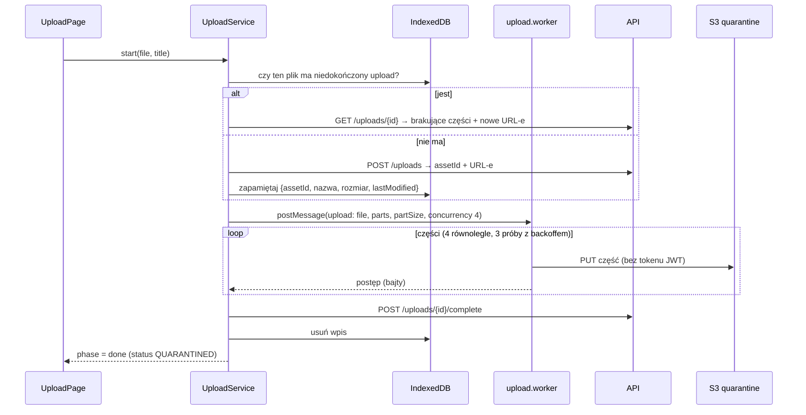

# Frontend — Angular SPA

Aplikacja Angular 22 (standalone components, signals, zoneless) ze stylami Tailwind CSS 4 + daisyUI 5. Hostowana jako statyczne pliki w S3 za CloudFront (`infra/modules/frontend-hosting`). Rozmawia z trzema usługami AWS:

| Usługa | Po co | Jak |
|---|---|---|
| Cognito | logowanie | `angular-auth-oidc-client`, authorization code + PKCE, managed login |
| API Gateway | dane i operacje | `HttpClient` + interceptor doklejający `Authorization: Bearer` (tylko do `apiUrl`) |
| S3 | pliki | bezpośrednio, po presigned URL-ach z API: `PUT` części do kwarantanny (Web Worker), `GET` miniatur/podglądów i pobieranie |

Polityka bezpieczeństwa treści (CSP) pozwala tylko na te hosty — szczegóły w [`infra/modules/frontend-hosting/README.md`](../infra/modules/frontend-hosting/README.md).

## Uruchomienie lokalne

```bash
just frontend-config                       # config.json z outputów Terraform (wymaga wdrożonego dev)
npm ci --ignore-scripts
npm start                                  # http://localhost:4200 (callback Cognito jest dozwolony)
npm test -- --watch=false                  # Vitest + jsdom
npm run lint
npm run build                              # dist/matchday-dam/browser
```

## Start aplikacji

1. `main.ts` pobiera `/config.json` (`loadRuntimeConfig`). Brak pliku = czytelny komunikat zamiast pustej strony.
2. `createAppConfig(runtime)`: locale `pl` (daty `3.10.2026, 14:48`), router, `HttpClient` z `authInterceptor`, konfiguracja OIDC (`buildOidcConfig`): odświeżanie tokenu refresh tokenem, `secureRoutes = [apiUrl]` (token nie wycieka do innych hostów, np. S3).
3. Ten sam build działa w każdym środowisku — różni się tylko `config.json` (zapisuje go Terraform).

## Struktura

```
src/app/
├── app.ts, app.routes.ts, app.config.ts   powłoka, nawigacja, trasy, providery
├── core/
│   ├── config/runtime-config.ts           typ i ładowanie /config.json
│   ├── auth/
│   │   ├── auth.service.ts                sygnały: isAuthenticated, groups, email; login/logout
│   │   ├── oidc-config.ts                 konfiguracja klienta OIDC dla Cognito
│   │   ├── auth-callback.ts               /auth/callback: dokończenie logowania, powrót na zapamiętaną stronę
│   │   ├── require-groups.guard.ts        strażnik tras po grupach (UX, nie bezpieczeństwo)
│   │   └── user-group.ts                  admin | staff | contributor | viewer
│   ├── api/
│   │   ├── generated-types/               typy z Rusta (ts-rs) — NIE edytować ręcznie
│   │   ├── assets.service.ts              GET /assets, download, publish, rescan, DELETE
│   │   ├── asset-pager.ts                 stronicowanie kursorem („Pokaż więcej”)
│   │   ├── asset-status.ts                etykiety i kolory statusów, isInProgress
│   │   ├── download.service.ts            pobranie: presigned URL → nawigacja przeglądarki
│   │   ├── delete-asset.service.ts        potwierdzenie i usunięcie assetu
│   │   └── me.service.ts                  GET /me
│   ├── upload/
│   │   ├── upload.service.ts              orkiestracja uploadu (stan jako sygnał)
│   │   ├── upload-api.service.ts          POST /uploads, GET /uploads/{id}, POST …/complete
│   │   ├── upload.worker.ts               Web Worker wysyłający części
│   │   ├── upload-protocol.ts             wiadomości strona ↔ worker, równoległa wysyłka z ponowieniami
│   │   └── pending-uploads.store.ts       IndexedDB: niedokończone uploady do wznowienia
│   └── format/file-size.pipe.ts           rozmiary w formacie polskim
├── features/
│   ├── pages/home-page.ts                 strona główna (wynik GET /me)
│   ├── gallery/gallery-page.ts            galeria (A, B, D), pobieranie, usuwanie (A)
│   ├── upload/upload-page.ts              formularz uploadu z postępem (A, C)
│   ├── submissions/my-submissions-page.ts moje zgłoszenia, auto-odświeżanie co 5 s (A, C)
│   ├── admin/admin-page.ts                kolejka publikacji, nieudane skany: publikuj, ponów, usuń (A)
│   └── assets/asset-card.ts               kafelek assetu z podglądem
└── testing/                               fake OIDC, fabryka assetów do testów
```

## Trasy i grupy

| Ścieżka | Strona | Grupy (`requireGroups`) |
|---|---|---|
| `/` | strona główna | wszyscy |
| `/auth/callback` | powrót z Cognito | — |
| `/gallery` | galeria | A, B, C, D (C widzi odsyłacz do „Moich zgłoszeń”, bo API nie wpuszcza C do galerii) |
| `/upload` | upload | A, C |
| `/my-submissions` | moje zgłoszenia | A, C |
| `/admin` | panel administratora | A |
| `/forbidden` | brak dostępu | — |

Strażnik i ukrywanie przycisków to **wyłącznie UX**. Każde żądanie i tak sprawdza API (grupy z tokenu w każdej Lambdzie).

## Upload pliku



- Wysyłanie odbywa się w **Web Workerze**, więc UI pozostaje płynne przy dużych plikach.
- Do S3 nie jest wysyłany token Cognito — presigned URL sam w sobie jest autoryzacją, ograniczoną do jednej części jednego uploadu.
- Wznowienie: po ponownym wybraniu tego samego pliku (nazwa, rozmiar, data modyfikacji) upload rusza od brakujących części. Bez IndexedDB (tryb prywatny) wznawianie po prostu nie jest dostępne.
- Formularz akceptuje tylko JPEG, PNG i WebP do 200 MB (te same limity sprawdza backend).

## Typy z backendu

Katalog `core/api/generated-types/` generuje `cargo test` w `lambdas/` (`ts-rs`). Zmiana modelu w Ruście → `cargo test` → commit wygenerowanych plików; CI sprawdza, że są aktualne. `STATUS_PRESENTATION: Record<AssetStatus, …>` wymusza obsłużenie każdego nowego statusu w UI (błąd kompilacji, jeśli go zabraknie).

## Testy

Vitest + jsdom, testy przy komponentach i serwisach (`*.spec.ts`): strażnik grup, konfiguracja OIDC, serwisy API, upload (protokół, ponowienia, wznawianie), galeria (podglądy, pobieranie, usuwanie z potwierdzeniem, brak przycisków dla B/D), panel admina, moje zgłoszenia. `FakeOidcSecurityService` w `testing/` pozwala symulować zalogowanego użytkownika z dowolnymi grupami.
