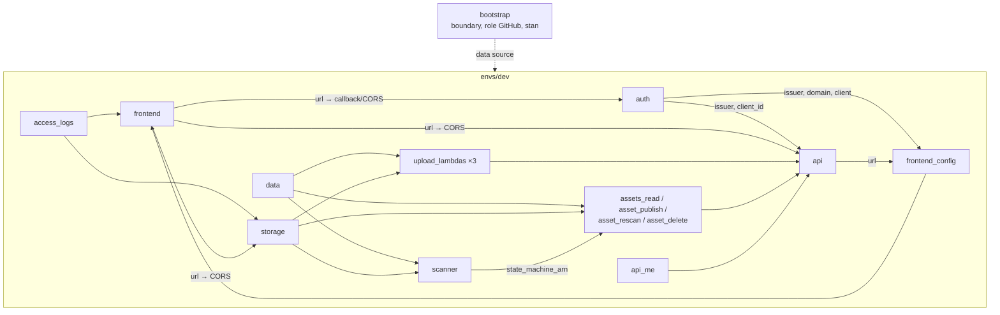

# Infrastruktura (Terraform) — Matchday DAM

Cała infrastruktura AWS jest opisana w Terraform (≥ 1.10, CI używa 1.16; provider AWS ≥ 6.0). Ręcznie w konsoli nie zakłada się niczego poza jednorazowym bootstrapem konta.

Co robią te zasoby razem: [`docs/architecture.md`](../docs/architecture.md). Pierwsze wdrożenie krok po kroku: [`docs/setup-aws.md`](../docs/setup-aws.md).

## Struktura

```
infra/
├── bootstrap/              jednorazowo, z konta administratora (CloudShell)
│   ├── state.tf            bucket stanu Terraform (wersjonowany, lock przez .tflock)
│   ├── github_oidc.tf      dostawca OIDC GitHub, role dam-github-plan i dam-github-deploy
│   ├── permissions_boundary.tf   dam-permissions-boundary dla wszystkich ról projektu
│   └── budgets.tf          alerty kosztowe 5 i 20 USD
├── envs/
│   └── dev/                środowisko dev: składa moduły, polityki IAM Lambd API, trasy
│       ├── main.tf
│       ├── backend.tf      stan w S3 (bucket z TF_STATE_BUCKET, use_lockfile)
│       ├── variables.tf    region, prefiks, katalog artefaktów, obraz skanera, e-mail alertów
│       └── outputs.tf      adresy, nazwy bucketów i tabel, ID Cognito, ARN maszyny stanów
└── modules/
    ├── rust-lambda/        funkcja Lambda w Ruście + własna rola IAM + log group
    ├── auth/               Cognito: pula, grupy A–D, domena, klient SPA, klient e2e
    ├── frontend-hosting/   S3 + CloudFront (OAC, CSP, HSTS), config.json
    ├── access-logs/        bucket logów dostępu S3 i CloudFront
    ├── storage/            buckety quarantine, clean, renditions, infected + polityki
    ├── data/               DynamoDB: assets (2 indeksy), incidents
    ├── http-api/           API Gateway HTTP API + autoryzator JWT + trasy
    └── scanner/            ECR, EventBridge → SQS → start-scan, Step Functions,
                            Lambdy pipeline'u, alert SNS
```

## Moduły

| Moduł | README | Najważniejsze zasoby |
|---|---|---|
| `rust-lambda` | [README](modules/rust-lambda/README.md) | `aws_lambda_function` (arm64, `provided.al2023`), `aws_iam_role` `dam-<name>`, polityki `dam-<name>-<klucz>`, log group 14 dni |
| `auth` | [README](modules/auth/README.md) | user pool, 4 grupy, domena managed login, klient SPA (PKCE), klient e2e |
| `frontend-hosting` | [README](modules/frontend-hosting/README.md) | bucket SPA, dystrybucja CloudFront, polityka nagłówków, `config.json` |
| `access-logs` | [README](modules/access-logs/README.md) | bucket logów (30 dni) |
| `storage` | [README](modules/storage/README.md) | 4 buckety plików, lifecycle, Object Lock, CORS, polityki Deny |
| `data` | [README](modules/data/README.md) | tabele `assets`, `incidents`, `dictionaries` |
| `http-api` | [README](modules/http-api/README.md) | HTTP API, autoryzator JWT, stage z throttlingiem i logami, integracje |
| `scanner` | [README](modules/scanner/README.md) | ECR, SQS + DLQ, reguły EventBridge, 6 Lambd pipeline'u, maszyna stanów, SNS |

Bootstrap: [README](bootstrap/README.md).

## Zależności między modułami (`envs/dev/main.tf`)



Uwaga na cykl: frontend potrzebuje adresów Cognito i API (`config.json`), a Cognito i API potrzebują adresu frontendu (callback, CORS). Cykl jest przerwany tym, że `config.json` to osobny obiekt S3 zależny od wszystkich trzech modułów, a CSP używa wzorców hostów regionu zamiast dokładnych adresów.

## Konwencje

- **Prefiks** `matchday-dam-dev` (`<project>-<environment>`) dla wszystkich zasobów regionalnych; buckety dodatkowo z ID konta (globalna unikalność).
- **Role** `dam-<funkcja>`, bez nazwy środowiska (jedno konto, ADR 0012). Każda rola ma `permissions_boundary = dam-permissions-boundary` — bez tego rola deployu nie może jej utworzyć.
- **Polityki** jako dokumenty `aws_iam_policy_document` przy module, który ich używa; tylko akcje i zasoby potrzebne funkcji. Polityki bucketów (`modules/storage`) to druga linia obrony.
- **Szyfrowanie**: SSE-S3 / klucze AWS zamiast KMS CMK (koszt; dane fikcyjne — ryzyko zaakceptowane). Checkov ma jawne `#checkov:skip` z uzasadnieniem.
- **Logi**: 14 dni dla Lambd, API Gateway i Step Functions, 30 dni w `access-logs`.
- **Artefakty Lambd**: `var.lambda_artifacts_dir` (domyślnie `lambdas/target/lambda`), plik `<crate>/bootstrap.zip`. Terraform wykrywa zmianę kodu przez `source_code_hash`.
- **Obraz skanera**: `var.scanner_image_uri` (ustawia `deploy.yml` / `plan.yml`). Pusty = funkcja `scan`, maszyna stanów i wyzwalacz `start-scan` nie powstają (pierwszy apply przed zbudowaniem obrazu).

## Zmienne środowiska `dev`

| Zmienna | Domyślnie | Skąd w CI |
|---|---|---|
| `region` | `eu-central-1` | — |
| `project` / `environment` | `matchday-dam` / `dev` | — |
| `lambda_artifacts_dir` | `../../../lambdas/target/lambda` | artefakt `lambdas` z `ci.yml`, pobrany do `dist/lambda` (poza `lambdas/target`, który czyści rust-cache) → `TF_VAR_lambda_artifacts_dir` |
| `scanner_image_uri` | `""` | `scripts/build-scanner.sh` → `TF_VAR_scanner_image_uri` |
| `alert_email` | `""` | zmienna repozytorium `ALERT_EMAIL` → `TF_VAR_alert_email` |

## Outputs

`frontend_url`, `frontend_bucket`, `frontend_distribution_id`, `frontend_config`, `api_url`, `cognito_user_pool_id`, `cognito_client_id`, `cognito_e2e_client_id`, `cognito_issuer_url`, `cognito_domain_url`, `storage_buckets`, `assets_table`, `incidents_table`, `dictionaries_table`, `scanner_repository_name`, `scanner_repository_url`, `scan_dlq_url`, `scan_state_machine_arn`, `hello_world_function_name`.

```bash
terraform -chdir=infra/envs/dev output -raw api_url
```

## Polecenia

```bash
just init      # terraform init z bucketem stanu (TF_STATE_BUCKET)
just plan      # plan dev (wymaga zbudowanych Lambd: just build-lambdas)
just deploy    # apply dev
just destroy   # usunięcie środowiska dev
```

W praktyce zmiany wchodzą przez PR: `plan.yml` pokazuje plan w komentarzu, `deploy.yml` robi apply po merge. Statyczne sprawdzenia (`terraform fmt`, `validate`, `tflint`, Checkov) uruchamia `ci.yml` i `just check`.
