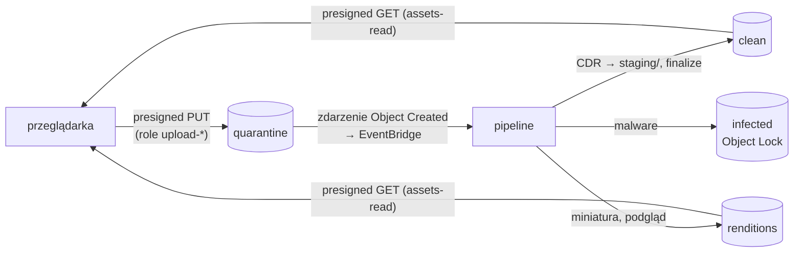

# Moduł `storage` — buckety plików

Cztery buckety S3, przez które przechodzi każdy plik od użytkownika, z politykami ograniczającymi dostęp do konkretnych ról Lambd (druga linia obrony obok polityk IAM).

## Buckety

Nazwa: `<name_prefix>-<bucket>-<id konta>`, np. `matchday-dam-dev-quarantine-891048843451`.

| Bucket | Zawartość | Czytają (`bucket_access.readers`) | Zapisują (`writers`) | Lifecycle |
|---|---|---|---|---|
| `quarantine` | oryginały od użytkowników (`<assetId>`) | `dam-validate`, `dam-scan`, `dam-cdr`, `dam-handle-infected` | `dam-upload-init`, `dam-upload-status`, `dam-upload-complete` | obiekty 7 dni, wersje 1 dzień |
| `clean` | pliki po CDR (`<assetId>`, `staging/<assetId>`) | `dam-assets-read`, `dam-finalize-clean`, `dam-renditions` | `dam-finalize-clean`, `dam-cdr` | wersje 30 dni; `staging/` 1 dzień |
| `renditions` | `thumb/<id>.jpg`, `preview/<id>.jpg` | `dam-assets-read` | `dam-renditions` | wersje 7 dni |
| `infected` | dowody incydentów (`<assetId>`) | **nikt** | `dam-handle-infected` | obiekty i wersje 90 dni; **Object Lock GOVERNANCE 90 dni** |

Każdy bucket: przerwanie porzuconych uploadów multipart po 2 dniach.

## Zabezpieczenia wspólne

| Zasób | Konfiguracja |
|---|---|
| `aws_s3_bucket_public_access_block` | wszystkie 4 flagi `true` |
| `aws_s3_bucket_ownership_controls` | `BucketOwnerEnforced` (bez ACL) |
| `aws_s3_bucket_server_side_encryption_configuration` | SSE-S3 (`AES256`) |
| `aws_s3_bucket_versioning` | włączone (odzyskiwanie usuniętych, wymagane przez Object Lock) |
| `aws_s3_bucket_logging` | do bucketu `access-logs`, prefiks `s3/<bucket>/` |
| `aws_s3_bucket_policy` | patrz niżej |

## Polityka bucketu

Dla każdego bucketu trzy instrukcje `Deny`:

1. **`DenyInsecureTransport`** — `s3:*` bez TLS (`aws:SecureTransport = false`).
2. **`DenyReadExceptAllowedRoles`** — `s3:GetObject`, `s3:GetObjectVersion` dla każdego, czyj `aws:PrincipalArn` nie pasuje do listy `readers`. Pusta lista = Deny dla wszystkich.
3. **`DenyWriteExceptAllowedRoles`** — `s3:PutObject` analogicznie dla `writers`.

Presigned URL działa z uprawnieniami roli, która go podpisała: przeglądarka wysyłająca część pliku jest dla S3 rolą `dam-upload-init` (lub `dam-upload-status`), a pobierająca miniaturę — rolą `dam-assets-read`.

Usuwanie obiektów (`s3:DeleteObject`) kontrolują polityki IAM ról (np. `dam-asset-delete`, `dam-finalize-clean`). Dla `infected` usunięcie i tak blokuje Object Lock.

## Kwarantanna: zdarzenia i CORS

- `aws_s3_bucket_notification.quarantine` z `eventbridge = true` — każdy nowy obiekt emituje „Object Created” do EventBridge (reguła w module `scanner`).
- `aws_s3_bucket_cors_configuration.quarantine` — tylko `PUT` z originów SPA (`upload_allowed_origins`), dozwolone nagłówki sum kontrolnych, **odsłonięty `ETag`** (przeglądarka potrzebuje go do zakończenia uploadu multipart).

## Object Lock (`infected`)

Tryb **GOVERNANCE**, 90 dni: obiektu nie da się nadpisać ani usunąć przed upływem retencji, chyba że rola ma `s3:BypassGovernanceRetention` (w dev tylko deploy, na potrzeby `terraform destroy`). Tryb COMPLIANCE nie pozwoliłby na to nikomu, łącznie z kontem root, co w środowisku dev uniemożliwiłoby sprzątanie.

## Zmienne

| Zmienna | Domyślnie | Opis |
|---|---|---|
| `name_prefix` | — | `matchday-dam-dev` |
| `bucket_access` | role z tabeli wyżej | nazwy ról (nie ARN-y) z dostępem do odczytu/zapisu; walidacja wymaga wszystkich 4 bucketów |
| `upload_allowed_origins` | — | originy SPA dla CORS |
| `log_bucket_id` | — | bucket `access-logs` |
| `quarantine_retention_days` | 7 | |
| `infected_retention_days` | 90 | lifecycle i Object Lock |
| `force_destroy` | `true` | dev: `terraform destroy` usuwa też zawartość |

Outputs: `bucket_names`, `bucket_arns` (mapy po nazwie bucketu).

Nowa funkcja czytająca lub zapisująca pliki wymaga dopisania jej roli do `bucket_access` — inaczej polityka bucketu zablokuje ją mimo poprawnej polityki IAM.
