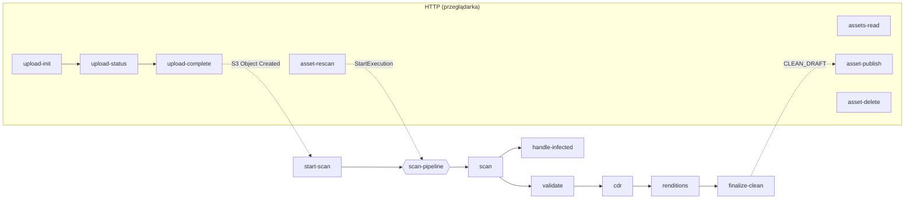

# Lambdy — Matchday DAM

Cargo workspace z całym backendem: 16 funkcji AWS Lambda w Ruście (edition 2024) i wspólna biblioteka [`shared`](shared/README.md). Każda funkcja ma własny katalog, własny `README.md`, własną rolę IAM i własne testy.

Jak funkcje łączą się w system: [`docs/architecture.md`](../docs/architecture.md). Kontrakt HTTP: [`docs/api.md`](../docs/api.md).

## Mapa funkcji

### API (wywoływane przez API Gateway, zdarzenie HTTP API v2)

| Katalog | Funkcja w AWS | Trasa | Grupy | Rola IAM | Co robi |
|---|---|---|---|---|---|
| [`api/me`](api/me/README.md) | `matchday-dam-dev-api-me` | `GET /me` | każda | `dam-api-me` | Zwraca `sub`, e-mail i grupy z tokenu |
| [`api/upload-init`](api/upload-init/README.md) | `matchday-dam-dev-upload-init` | `POST /uploads` | A, C | `dam-upload-init` | Waliduje metadane, zakłada upload multipart w kwarantannie, zapisuje asset `UPLOADING`, wystawia presigned URL-e części |
| [`api/upload-status`](api/upload-status/README.md) | `matchday-dam-dev-upload-status` | `GET /uploads/{assetId}` | A, C (autor) | `dam-upload-status` | Lista części w S3 i nowe URL-e dla brakujących (wznawianie) |
| [`api/upload-complete`](api/upload-complete/README.md) | `matchday-dam-dev-upload-complete` | `POST /uploads/{assetId}/complete` | A, C (autor) | `dam-upload-complete` | Sprawdza rozmiar w S3, kończy upload (`QUARANTINED`) albo przerywa (`REJECTED`) |
| [`api/assets-read`](api/assets-read/README.md) | `matchday-dam-dev-assets-read` | `GET /assets`, `GET /assets/{assetId}/download` | zależnie od widoku | `dam-assets-read` | Galeria, moje zgłoszenia, kolejka publikacji, nieudane skany; presigned URL-e do miniatur, podglądów i plików |
| [`api/asset-publish`](api/asset-publish/README.md) | `matchday-dam-dev-asset-publish` | `POST /assets/{assetId}/publish` | A | `dam-asset-publish` | `CLEAN_DRAFT`/`ARCHIVED` → `PUBLISHED` |
| [`api/asset-rescan`](api/asset-rescan/README.md) | `matchday-dam-dev-asset-rescan` | `POST /assets/{assetId}/rescan` | A | `dam-asset-rescan` | `SCAN_FAILED` → `SCANNING` i nowe wykonanie pipeline'u |
| [`api/asset-delete`](api/asset-delete/README.md) | `matchday-dam-dev-asset-delete` | `DELETE /assets/{assetId}` | A | `dam-asset-delete` | Usuwa pliki i rekord (bez zainfekowanych i będących w przetwarzaniu) |

### Pipeline bezpieczeństwa (SQS i Step Functions)

| Katalog | Funkcja w AWS | Wyzwalacz | Rola IAM | Co robi |
|---|---|---|---|---|
| [`pipeline/start-scan`](pipeline/start-scan/README.md) | `matchday-dam-dev-start-scan` | SQS `scan-queue` | `dam-start-scan` | Zdarzenie S3 → `StartExecution` maszyny `scan-pipeline` (nazwa = assetId) |
| [`pipeline/scan`](pipeline/scan/README.md) | `matchday-dam-dev-scan` (obraz kontenera, x86_64) | stan `Scan` | `dam-scan` | Skan ClamAV (`clamd`) pliku z kwarantanny → `CLEAN`/`INFECTED`/`FAILED` |
| [`pipeline/validate`](pipeline/validate/README.md) | `matchday-dam-dev-validate` | stan `Validate` | `dam-validate` | Typ z magic bytes, zgodność z deklaracją, rozmiar, wymiary z nagłówka |
| [`pipeline/cdr`](pipeline/cdr/README.md) | `matchday-dam-dev-cdr` | stan `Disarm` | `dam-cdr` | Rekonstrukcja obrazu (dekodowanie + kodowanie), whitelista EXIF → `clean/staging/<id>` |
| [`pipeline/renditions`](pipeline/renditions/README.md) | `matchday-dam-dev-renditions` | stan `Renditions` | `dam-renditions` | Miniatura 400 px i podgląd 1200 px ze znakiem wodnym → `renditions` |
| [`pipeline/finalize-clean`](pipeline/finalize-clean/README.md) | `matchday-dam-dev-finalize-clean` | stan `FinalizeClean` | `dam-finalize-clean` | `staging/<id>` → `<id>`, usunięcie oryginału, `CLEAN_DRAFT` z metadanymi |
| [`pipeline/handle-infected`](pipeline/handle-infected/README.md) | `matchday-dam-dev-handle-infected` | stan `HandleInfected` | `dam-handle-infected` | Plik do `infected` (Object Lock), `INFECTED`, incydent, zdarzenie `asset.infected` |

### Pozostałe

| Katalog | Co robi |
|---|---|
| [`hello-world`](hello-world/README.md) | Funkcja z etapu 0 do weryfikacji łańcucha build → deploy (smoke test w `deploy.yml`) |
| [`shared`](shared/README.md) | Biblioteka: statusy, autoryzacja, upload, katalog, kontrakty pipeline'u, DynamoDB, S3, logowanie |

## Kolejność wywołań



## Wspólne zasady kodu

Każda funkcja jest zbudowana według tego samego wzorca, więc po przeczytaniu jednej łatwo czytać pozostałe:

1. **`main()`** inicjalizuje logowanie JSON (`shared::telemetry::init`), klientów AWS SDK i konfigurację ze zmiennych środowiskowych (`shared::http::env` — brak zmiennej = panika przy starcie, bo to błąd wdrożenia). Klienci są tworzeni raz na środowisko wykonawcze i współdzieleni przez `Arc<App>`.
2. **`handle()` / `handler()`** to czysta logika: przyjmuje `&App` i zdarzenie, zwraca wynik albo błąd domenowy. Dzięki temu da się ją testować bez AWS.
3. **Lambdy API** zwracają `Result<(StatusCode, T), ApiError>`, a `shared::http::respond` zamienia to na odpowiedź JSON. Pierwsze linie handlera to zawsze: `http::caller(request)?` (401 bez claimów) i `caller.require_any_group(...)` (403).
4. **Lambdy pipeline'u** przyjmują `shared::pipeline::StepInput` i zwracają typowany wynik (`ScanOutcome`, `ValidationOutcome`, ...). Wynik „plik zły” to normalna wartość (`Rejected`, `Infected`); `Err` oznacza awarię, którą Step Functions ponowi, a potem skieruje do `SCAN_FAILED`.
5. **Identyfikator assetu** jest zawsze sprawdzany (`is_asset_id` / `checked_asset_id`) przed zbudowaniem klucza S3 lub DynamoDB.
6. **Zmiany statusu** tylko przez `shared::assets::transition` / `transition_idempotent` (warunkowy `UpdateItem`).
7. **Logi** zawierają `asset_id`, `sub` i wynik, nigdy treści pliku, nazwy pliku ani tytułu.
8. **Lints**: `clippy::pedantic` jako ostrzeżenia (w CI `-D warnings`), `unsafe_code = "forbid"`.

## Zmienne środowiskowe (wszystkie funkcje)

| Zmienna | Funkcje | Wartość |
|---|---|---|
| `RUST_LOG` | wszystkie | poziom logów (`info`), ustawia moduł `rust-lambda` |
| `ASSETS_TABLE` | upload-*, assets-read, asset-*, validate, finalize-clean, handle-infected | `matchday-dam-dev-assets` |
| `INCIDENTS_TABLE` | handle-infected | `matchday-dam-dev-incidents` |
| `QUARANTINE_BUCKET` | upload-*, asset-delete, start-scan, scan, validate, cdr, finalize-clean, handle-infected | bucket kwarantanny |
| `CLEAN_BUCKET` | assets-read, asset-delete, cdr, renditions, finalize-clean | bucket `clean` |
| `RENDITIONS_BUCKET` | assets-read, asset-delete, renditions | bucket `renditions` |
| `INFECTED_BUCKET` | handle-infected | bucket `infected` |
| `STATE_MACHINE_ARN` | start-scan, asset-rescan | ARN `scan-pipeline` |
| `EVENT_BUS_NAME` | handle-infected | opcjonalna, domyślnie `default` |
| `CLAMD_CONFIG` | scan | ustawiana w obrazie kontenera |

## Budowanie i testy

```bash
cd lambdas
cargo fmt --all --check
cargo clippy --all-targets --locked -- -D warnings
cargo test --locked                  # testy + generowanie typów TS do frontend/.../generated-types
cargo lambda build --release --arm64 --output-format zip --locked
#   → target/lambda/<nazwa crate>/bootstrap.zip (np. api-upload-init, pipeline-cdr)
```

Albo z katalogu głównego: `just check`, `just build-lambdas`.

Funkcja `scan` jest wyjątkiem: to obraz kontenera x86_64 z ClamAV budowany przez `scripts/build-scanner.sh` (szczegóły w [`pipeline/scan/README.md`](pipeline/scan/README.md)).

Profil `release`: `opt-level = "s"`, thin LTO, `codegen-units = 4`, `strip`, `panic = "abort"` — małe binarki, szybki cold start, rozsądny czas budowania.

## Dodanie nowej funkcji

1. `cargo new --bin api/<nazwa>` (albo `pipeline/<nazwa>`), nazwa crate `api-<nazwa>` / `pipeline-<nazwa>`, dopisanie do `members` w `Cargo.toml`, `[lints] workspace = true`.
2. Logika w `handle()` z testami; wspólne typy w `shared`.
3. Moduł `rust-lambda` w `infra/envs/dev/main.tf` (albo `modules/scanner/pipeline.tf`) z polityką IAM ograniczoną do potrzebnych akcji i zasobów.
4. Jeśli funkcja czyta lub zapisuje obiekty w bucketach plików: dopisanie roli do `bucket_access` w `infra/modules/storage/variables.tf`.
5. Trasa w `module "api"` (dla API) albo stan w maszynie (`pipeline.tf`).
6. `README.md` funkcji według wzorca pozostałych.
