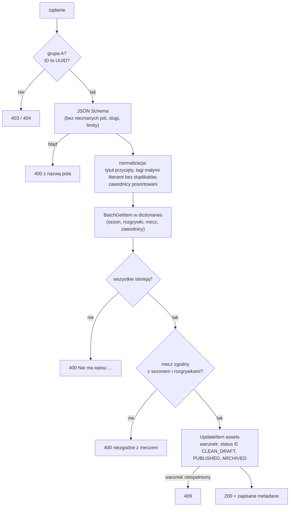

# `api-asset-metadata` — `PUT /assets/{assetId}/metadata`

Metadane assetu ustawiane przez administratora po skanie:

- kategoria (zdjęcia meczowe, treningowe, wideo, identyfikacja wizualna, materiały sponsorskie, dokumenty prasowe),
- sezon, rozgrywki i mecz,
- zawodnicy na zdjęciu,
- tagi i tytuł.

Referencje do słowników to **identyfikatory, nie wolny tekst**, więc galerię da się filtrować (część 2 etapu 3), a literówka nie tworzy nowego zawodnika.

| | |
|---|---|
| Funkcja AWS | `matchday-dam-dev-asset-metadata` |
| Wyzwalacz | API Gateway, `PUT /assets/{assetId}/metadata` |
| Grupy | A |
| Rola IAM | `dam-asset-metadata` |
| Pamięć / timeout | 128 MB / 10 s |
| Zmienne | `ASSETS_TABLE`, `DICTIONARIES_TABLE` |
| Kod | [`src/main.rs`](src/main.rs), model i walidacja: [`shared/src/metadata.rs`](../../shared/src/metadata.rs), schemat: [`shared/schemas/asset-metadata.schema.json`](../../shared/schemas/asset-metadata.schema.json) |

## Żądanie

Żądanie **zastępuje całość**: pole pominięte albo `null` usuwa wartość, pusta lista usuwa zawodników albo tagi.

```json
{
  "title": "Gol w 90. minucie",
  "category": "MATCH_PHOTO",
  "matchId": "2025-09-13-unia-lesna",
  "seasonId": null,
  "competitionId": null,
  "playerIds": ["michal-kruk"],
  "tags": ["bramka", "kibice"]
}
```

## Działanie krok po kroku



1. **JSON Schema** (`asset-metadata.schema.json`): `additionalProperties: false`, tytuł bez `<>` i znaków sterujących (maks. 120), kategoria z listy, slugi (`^[a-z0-9][a-z0-9-]*$`, maks. 64), maks. 30 zawodników bez powtórzeń, maks. 10 tagów po 1–30 znaków (litery, cyfry, spacje, myślniki; polskie znaki dozwolone). Komunikat błędu wskazuje pole, ale nie powtarza wartości.
2. **Normalizacja**: pusty tytuł to brak tytułu, tagi `Bramka` i `bramka` to jeden tag `bramka`.
3. **Referencje**: jedno `BatchGetItem` (odczyt silnie spójny) na wszystkie klucze, z ponowieniem nieprzetworzonych kluczy. Pierwszy brakujący wpis → 400 `Nie ma wpisu players/… w słownikach`.
4. **Mecz wyznacza sezon i rozgrywki**: puste pola są uzupełniane z meczu, sprzeczne odrzucane. Asset nie może być jednocześnie z meczu ligowego i z pucharu.
5. **Zapis**: jeden `UpdateItem` z `SET` dla podanych pól i `REMOVE` dla pustych. Zawodnicy i tagi są zapisywane jako zbiory `SS`, bo DynamoDB nie pozwala na pusty zbiór, więc pusta lista oznacza `REMOVE`. Dodatkowo zapisywane są `metadataUpdatedAt`, `metadataUpdatedBy` (`sub` admina) i `updatedAt`.
6. **Warunek statusu**: metadane można zmieniać tylko assetom po pipeline'ie. Plik w kwarantannie, odrzucony albo zainfekowany → 409.

Odpowiedź to zapisane metadane, na przykład z sezonem i rozgrywkami uzupełnionymi z meczu. Frontend podmienia nimi kafelek bez przeładowania listy.

## Uprawnienia (`dam-asset-metadata-main`)

| Akcja | Zasób | Po co |
|---|---|---|
| `dynamodb:BatchGetItem` | `dictionaries` | istnienie referencji |
| `dynamodb:UpdateItem` | `assets` | zapis metadanych (warunkowy) |

Funkcja nie ma dostępu do S3 ani do zmiany statusu: warunek w `UpdateItem` sprawdza status, ale go nie ustawia.

## Odpowiedzi

| Kod | Kiedy |
|---|---|
| 200 | zapisane metadane |
| 400 | błąd schematu, nieistniejący wpis słownika, sezon lub rozgrywki niezgodne z meczem |
| 403 | nie A |
| 404 | ID nie jest UUID |
| 409 | asset nie istnieje albo nie przeszedł pipeline'u |

## Frontend

Przycisk **Opisz** w panelu admina (kolejka publikacji) i w galerii (A) otwiera edytor (`MetadataEditor`):

- wybór meczu sam ustawia sezon i rozgrywki;
- zawodnicy to lista checkboxów (byli zawodnicy oznaczeni „(były)”);
- tagi wpisuje się po przecinku;
- komunikat 400 z API (np. o nieistniejącym wpisie) jest wyświetlany w oknie.

## Testy

- `only_admins_can_edit_metadata`;
- `invalid_requests_never_reach_aws`: zły UUID, `<script>`, wolny tekst zamiast meczu, próba ustawienia `status`;
- `unknown_players_are_rejected`, `match_sets_season_and_competition`;
- `update_sets_present_fields_and_removes_missing_ones`.

Schemat i normalizację testuje `shared::metadata`, a e2e pełny zapis z uzupełnieniem sezonu i normalizacją tagów.
