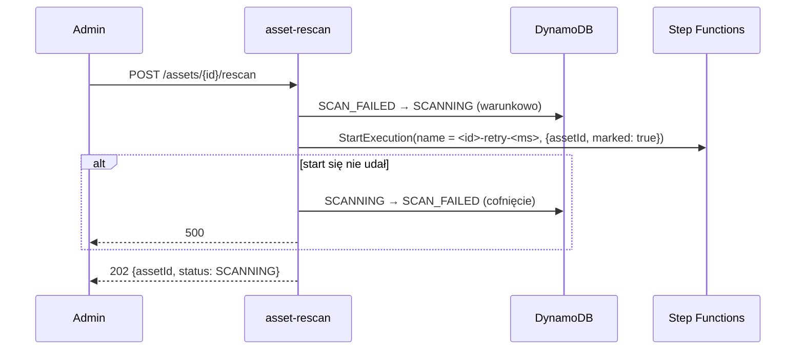

# `api-asset-rescan` — `POST /assets/{assetId}/rescan`

Ponowienie skanu przez administratora po statusie `SCAN_FAILED` (błąd skanera, timeout, chwilowa awaria). Zmienia status na `SCANNING` i uruchamia nowe wykonanie maszyny stanów `scan-pipeline`.

| | |
|---|---|
| Funkcja AWS | `matchday-dam-dev-asset-rescan` |
| Wyzwalacz | API Gateway, `POST /assets/{assetId}/rescan` |
| Grupy | A |
| Rola IAM | `dam-asset-rescan` |
| Pamięć / timeout | 128 MB / 10 s |
| Zmienne | `ASSETS_TABLE`, `STATE_MACHINE_ARN` |
| Kod | [`src/main.rs`](src/main.rs) |

## Działanie

1. Autoryzacja: tylko A; ID musi być UUID.
2. `transition(…, Scanning)`: warunek `#status IN (:QUARANTINED, :SCAN_FAILED)`. W praktyce tylko `SCAN_FAILED`, bo assety w `QUARANTINED` nie pojawiają się w panelu i i tak trafią do pipeline'u same. Inny status → **409**.
3. **Nazwa wykonania** `<assetId>-retry-<millis>` (`shared::pipeline::execution_name`): pierwsze wykonanie nazywa się dokładnie jak asset, więc ponowienie musi mieć inną nazwę.
4. **`marked: true`** w wejściu: stan `AlreadyMarked` pomija `MarkScanning` (status już jest `SCANNING`, warunek `QUARANTINED → SCANNING` by się nie spełnił).
5. Jeśli `StartExecution` się nie uda, status wraca na `SCAN_FAILED`, żeby asset nie utknął w `SCANNING`.

Plik musi nadal być w kwarantannie. Lifecycle usuwa go po 7 dniach; ponowienie po tym czasie skończy się znów `SCAN_FAILED` (`NoSuchKey` w kroku `Scan`).

## Uprawnienia (`dam-asset-rescan-main`)

| Akcja | Zasób |
|---|---|
| `dynamodb:UpdateItem` | `assets` |
| `states:StartExecution` | `scan-pipeline` |

## Odpowiedzi

| Kod | Kiedy |
|---|---|
| 202 | wykonanie uruchomione (wynik będzie widoczny w statusie assetu) |
| 403 | nie A |
| 404 | ID nie jest UUID |
| 409 | asset nie ma statusu `SCAN_FAILED` |
| 500 | nie udało się uruchomić wykonania (status cofnięty) |

## Testy

`only_admins_can_rescan`, `malformed_ids_never_reach_dynamodb`. Scenariusz e2e 14 sprawdza, że asset bez pliku w kwarantannie kończy jako `SCAN_FAILED`.
