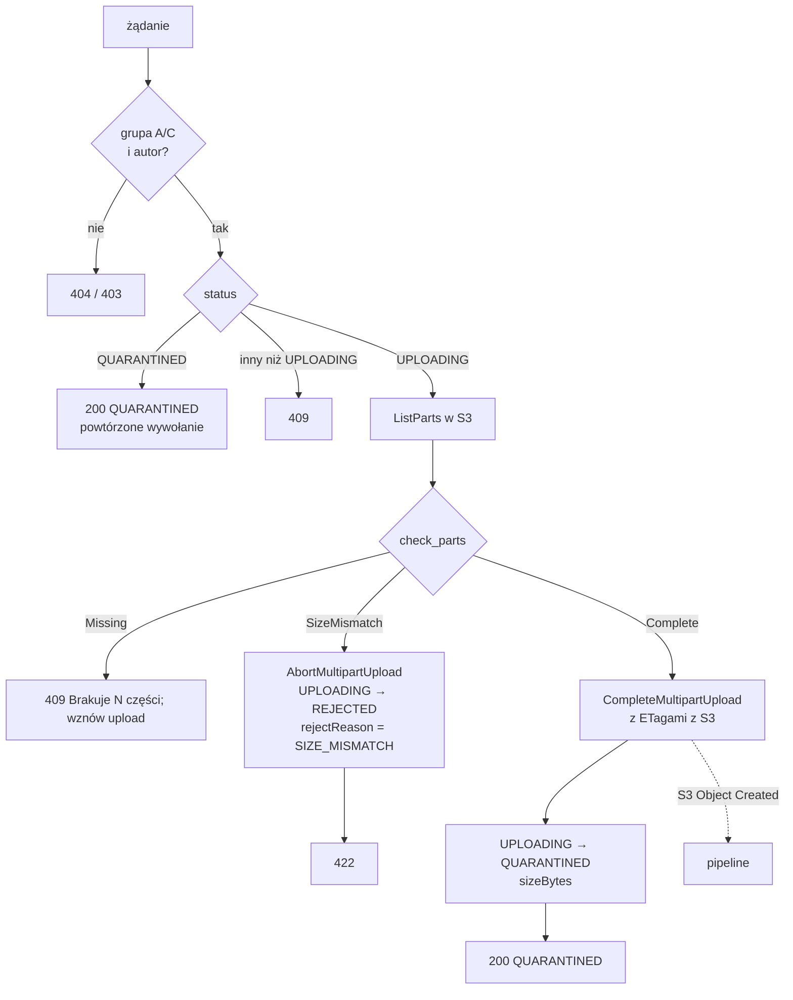

# `api-upload-complete` — `POST /uploads/{assetId}/complete`

Kończy upload multipart. **Rozmiar sprawdza na podstawie części faktycznie zapisanych w S3**, zanim obiekt w ogóle powstanie. Niezgodność z deklaracją przerywa upload, więc w kwarantannie nie zostaje nic (scenariusz 11). Udany upload przechodzi warunkowo `UPLOADING → QUARANTINED`, a S3 emituje zdarzenie, które uruchamia pipeline skanowania.

| | |
|---|---|
| Funkcja AWS | `matchday-dam-dev-upload-complete` |
| Wyzwalacz | API Gateway, `POST /uploads/{assetId}/complete` |
| Grupy | A, C — i tylko autor uploadu |
| Rola IAM | `dam-upload-complete` |
| Pamięć / timeout | 256 MB / 10 s |
| Zmienne | `ASSETS_TABLE`, `QUARANTINE_BUCKET` |
| Kod | [`src/main.rs`](src/main.rs), porównanie części: `shared::upload::check_parts` |

## Działanie

`check_parts(declaredSize, partSize, partCount, parts)` zwraca:

- **`SizeMismatch`**, gdy którakolwiek część ma numer spoza `1..partCount`, rozmiar inny niż oczekiwany dla swojej pozycji (`expected_part_size`), albo suma przekracza deklarację — klient wysłał więcej lub inaczej, niż zadeklarował;
- **`Missing`**, gdy wszystkie obecne części są poprawne, ale części brakuje — klient może dokończyć upload;
- **`Complete`**, gdy są wszystkie części, a suma równa się deklaracji.

`CompleteMultipartUpload` dostaje listę części z ETagami **odczytaną z S3**, nie przesłaną przez klienta.

Zmiana statusu to `shared::assets::transition` (warunkowy `UpdateItem`): jeśli w międzyczasie status się zmienił, odpowiedź to 409.

## Uprawnienia (`dam-upload-complete-main`)

| Akcja | Zasób | Po co |
|---|---|---|
| `s3:ListMultipartUploadParts` | `quarantine/*` | rozmiary części |
| `s3:PutObject` | `quarantine/*` | `CompleteMultipartUpload` |
| `s3:AbortMultipartUpload` | `quarantine/*` | przerwanie przy niezgodnym rozmiarze |
| `dynamodb:GetItem`, `dynamodb:UpdateItem` | `assets` | stan uploadu, zmiana statusu |

## Odpowiedzi

| Kod | Kiedy |
|---|---|
| 200 | `{ assetId, status: "QUARANTINED" }` (również przy powtórzonym wywołaniu) |
| 403 | grupa B lub D |
| 404 | asset nie istnieje albo należy do kogoś innego |
| 409 | brak części albo upload nie jest już w toku |
| 422 | rozmiar niezgodny z deklaracją (upload przerwany, `REJECTED`) |

## Testy

`store_errors_map_to_http_errors` (mapowanie błędów magazynu na kody HTTP). Logikę porównania części testuje `shared::upload` (`check_parts`), a pełny scenariusz „wysłano więcej niż zadeklarowano” — e2e (scenariusz 11).
