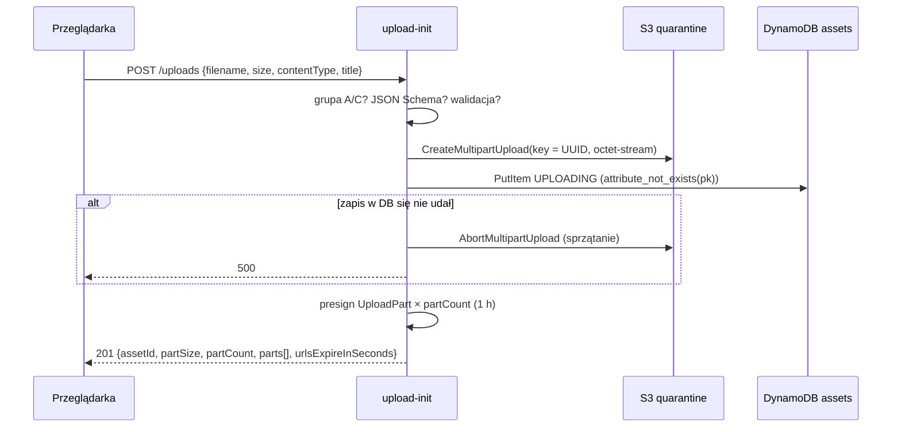

# `api-upload-init` — `POST /uploads`

Rozpoczyna upload pliku. **Plik nigdy nie przechodzi przez API**: funkcja tylko zakłada upload multipart w buckecie kwarantanny pod kluczem nadanym przez serwer, zapisuje asset ze statusem `UPLOADING` i zwraca przeglądarce presigned URL-e, pod które ta wyśle kolejne części pliku bezpośrednio do S3.

| | |
|---|---|
| Funkcja AWS | `matchday-dam-dev-upload-init` |
| Wyzwalacz | API Gateway, `POST /uploads` |
| Grupy | A (`admin`), C (`contributor`) |
| Rola IAM | `dam-upload-init` |
| Pamięć / timeout | 256 MB / 10 s |
| Zmienne | `ASSETS_TABLE`, `QUARANTINE_BUCKET` |
| Kod | [`src/main.rs`](src/main.rs), reguły w [`shared/src/upload.rs`](../../shared/src/upload.rs), schemat w [`shared/schemas/upload-init.schema.json`](../../shared/schemas/upload-init.schema.json) |

## Działanie krok po kroku

1. **Autoryzacja**: `caller()` (401 bez tokenu), `require_any_group([Admin, Contributor])` (403 dla B i D).
2. **Walidacja schematem** (`shared::upload::parse_init_request`): JSON Schema z `additionalProperties: false`, wzorcami bez znaków sterujących i `<>` w tytule, limitem rozmiaru i listą typów. Komunikat błędu wskazuje ścieżkę pola (`/contentType`), ale **nie powtarza wartości od klienta**.
3. **Walidacja domenowa** (`InitUploadRequest::validate`): plik niepusty, ≤ 200 MB, typ z listy (`image/jpeg`, `image/png`, `image/webp`), nazwa pliku sprowadzona do basename (`../../etc/x.jpg` → `x.jpg`) i oczyszczona ze znaków sterujących, tytuł ≤ 120 znaków.
4. **Podział na części** (`part_size_for`): 8 MiB albo więcej, jeśli plik nie zmieściłby się w 10 000 części.
5. **Klucz S3** = nowy UUID v4 (`quarantine_key`). Nazwa od użytkownika nigdy nie trafia do klucza, więc path traversal jest niemożliwy (scenariusz 7).
6. **`CreateMultipartUpload`** z `Content-Type: application/octet-stream` — zadeklarowany typ nie trafia do S3, żeby niezweryfikowany plik nigdy nie został zinterpretowany np. jako `text/html`. Metadana `asset-id` ułatwia diagnostykę.
7. **Rekord w `assets`** (`PutItem` z `attribute_not_exists(pk)`): `status = UPLOADING`, `uploaderId` (`sub`), `uploaderIp` (z API Gateway, trafi do incydentu, jeśli plik okaże się złośliwy), `originalFilename`, `title`, `declaredContentType`, `declaredSize`, `uploadId`, `partSize`, `partCount`, `createdAt`, `updatedAt`.
8. Jeśli zapis do DynamoDB się nie uda, upload multipart jest od razu przerywany (bez rekordu nie miałby właściciela).
9. **Presigned URL-e** `UploadPart` dla części 1..N, ważne 1 godzinę. Podpis wiąże bucket, klucz, `uploadId` i numer części (scenariusz 12). Klient S3 jest skonfigurowany z `RequestChecksumCalculation::WhenRequired`, żeby SDK nie dopisał do URL-a sumy kontrolnej, której przeglądarka nie wyśle.

## Uprawnienia (`dam-upload-init-main`)

| Akcja | Zasób | Po co |
|---|---|---|
| `s3:PutObject` | `quarantine/*` | `CreateMultipartUpload` i podpisywanie `UploadPart` (presigned URL działa z uprawnieniami tej roli) |
| `dynamodb:PutItem` | `assets` | rekord assetu |

Polityka bucketu kwarantanny dopuszcza zapis tylko trzem rolom uploadu; ta rola nie może czytać kwarantanny.

## Odpowiedzi

| Kod | Kiedy |
|---|---|
| 201 | upload założony |
| 400 | niepoprawny JSON, pole niezgodne ze schematem, plik pusty/za duży, typ spoza listy, nazwa pusta po oczyszczeniu |
| 401 | brak claimów |
| 403 | grupa B lub D |
| 500 | błąd S3/DynamoDB (szczegóły w logach) |

## Testy

`viewer_cannot_upload`, `staff_cannot_upload`, `rejects_svg_before_touching_aws` (SVG odrzucony bez żadnego wywołania AWS), `rejects_unknown_fields`, `request_without_token_is_unauthorized`. Reguły walidacji i zgodność schematu ze stałymi Rusta testuje `shared::upload`.
