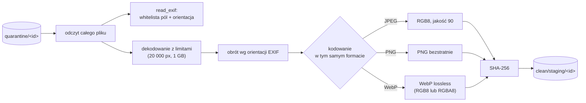

# `pipeline-cdr` — Content Disarm and Reconstruction

Najważniejsza warstwa ochrony przed treścią, której antywirus nie wykrywa. Obraz jest **dekodowany do samych pikseli i kodowany od nowa** w tym samym formacie. W nowym pliku nie ma niczego poza obrazem: znika EXIF/XMP/IPTC (np. XSS w polu EXIF), profil ICC, osadzone miniatury i każda treść doklejona do pliku (poligloty PNG+HTML/ZIP). Do galerii trafia **wyłącznie** ta zrekonstruowana kopia ([ADR 0007](../../../docs/adr/0007-cdr-reconstructed-images.md)).

| | |
|---|---|
| Funkcja AWS | `matchday-dam-dev-cdr` |
| Wyzwalacz | stan `Disarm` w `scan-pipeline` |
| Rola IAM | `dam-cdr` |
| Pamięć / timeout | 2048 MB / 120 s |
| Zmienne | `QUARANTINE_BUCKET`, `CLEAN_BUCKET` |
| Kod | [`src/main.rs`](src/main.rs) |

## Kontrakt

Wejście: `StepInput` z `validation: VALID` (używa `detectedType` i `sizeBytes`).

Wyjście (`shared::pipeline::DisarmOutcome`):

```json
{
  "result": "CLEAN",
  "sizeBytes": 6123456,
  "sha256": "9f86d08…",
  "metadata": { "artist": "Jan Kowalski", "copyright": "KS Matchday", "takenAt": "2025:09:14 18:02:11" }
}
{ "result": "REJECTED", "reason": "dekodowanie obrazu: …" }
```

`REJECTED` → `DisarmRejected` → `MarkRejected` (`rejectReason: cdr: …`). Błąd S3 → ponowienia → `SCAN_FAILED`.

## Działanie



1. Wymaga pozytywnej walidacji (inaczej `Err`) i ponownie sprawdza limit 200 MB.
2. Czyta cały oryginał z kwarantanny do pamięci.
3. **EXIF** (`read_exif`, `kamadak-exif`): z oryginału przepuszczamy tylko trzy pola — `Artist`, `Copyright`, `DateTimeOriginal` — po sanityzacji (bez znaków sterujących, bez `<` i `>`, max 200 znaków). Trafiają one do **metadanych assetu w DynamoDB**, nie z powrotem do pliku. Odczytujemy też orientację. Uszkodzony EXIF to nie błąd (i tak znika).
4. **Dekodowanie** (`image` crate) z limitami: max 20 000 px na bok, max 1 GB alokacji dekodera. Plik, którego nie da się zdekodować (uszkodzony, tylko udaje obraz), → `REJECTED`.
5. **Orientacja** stosowana do pikseli, żeby zdjęcie z aparatu nie było obrócone po usunięciu EXIF.
6. **Kodowanie** od zera:
   - JPEG → RGB8 (JPEG nie ma alfy), jakość 90 (wizualnie bez straty dla zdjęć prasowych),
   - PNG → PNG,
   - WebP → WebP bezstratny (z alfą, jeśli była).
7. **SHA-256** nowego pliku (do integralności i późniejszej deduplikacji).
8. Zapis do `clean/staging/<assetId>` z `Content-Type` z wykrytego typu. Publikowalną kopię `clean/<assetId>` tworzy dopiero `finalize-clean` po wygenerowaniu miniatur.

Oryginał od użytkownika nie trafia nigdzie dalej i jest usuwany z kwarantanny przez `finalize-clean`.

## Co usuwa CDR (przykłady z `tests/security-fixtures/`)

| Plik | Atak | Wynik |
|---|---|---|
| `exif-xss.jpg` | `<script>` w polu EXIF `ImageDescription`/`Artist` | pole spoza whitelisty znika, `Artist` po sanityzacji bez `<>` (scenariusz 2) |
| `polyglot.png` | poprawny PNG z doklejonym HTML/JS po `IEND` | doklejona treść znika (scenariusz 5) |
| obraz z ICC, XMP, miniaturą | ukryte dane, śledzenie | wszystko poza pikselami znika |

## Koszty i kompromisy

- Ponowne kodowanie JPEG jest stratne (q90) i usuwa profil ICC — świadomy koszt (ADR 0007, ryzyko zaakceptowane w modelu zagrożeń).
- 2048 MB pamięci: obraz 100 MP jako RGBA to ~400 MB plus bufory kodera.

## Uprawnienia (`dam-cdr-main`)

| Akcja | Zasób |
|---|---|
| `s3:GetObject` | `quarantine/*` |
| `s3:PutObject` | `clean/staging/*` |

Rola nie może zapisać `clean/<id>` bezpośrednio (tylko `staging/`), nie czyta `clean` i nie zmienia statusów.

## Testy

`strips_exif_payloads_and_keeps_whitelisted_fields`, `applies_orientation_before_dropping_exif`, `drops_content_appended_to_a_polyglot`, `rejects_data_that_is_not_a_valid_image`, `reencodes_webp_losslessly`, `sanitizes_exif_text`, `hashes_reconstructed_bytes`, `exif_xss_is_removed`, `polyglot_payload_is_removed`.
