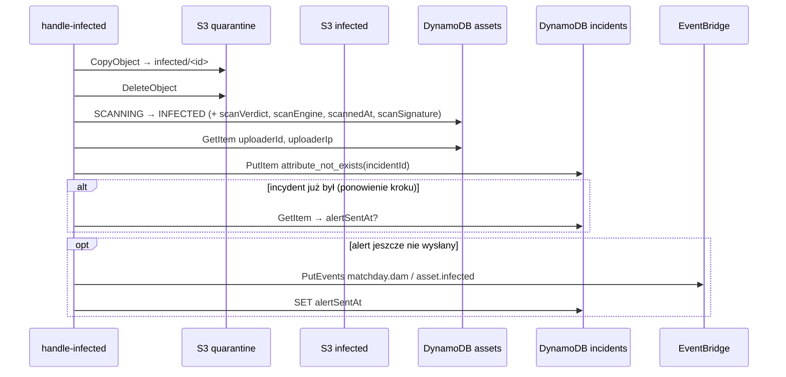

# `pipeline-handle-infected` — ścieżka zainfekowana

Krok `scan-pipeline` uruchamiany, gdy ClamAV wykrył malware. Zabezpiecza dowód, oznacza asset, zapisuje incydent i podnosi alarm.

| | |
|---|---|
| Funkcja AWS | `matchday-dam-dev-handle-infected` |
| Wyzwalacz | stan `HandleInfected` w `scan-pipeline` (po `Verdict = INFECTED`) |
| Rola IAM | `dam-handle-infected` |
| Pamięć / timeout | 256 MB / 120 s |
| Zmienne | `ASSETS_TABLE`, `INCIDENTS_TABLE`, `QUARANTINE_BUCKET`, `INFECTED_BUCKET`, opcjonalnie `EVENT_BUS_NAME` (domyślnie `default`) |
| Kod | [`src/main.rs`](src/main.rs) |
| Alert | `infra/modules/scanner/alerts.tf` |

## Kontrakt

Wejście: `StepInput` z `scan: { verdict: INFECTED, signature, engine }`. Inny werdykt → `Err` (błąd konfiguracji maszyny).

Wyjście: `{ "assetId": "…", "status": "INFECTED", "incidentId": "…" }` (koniec wykonania).

## Działanie



1. **Dowód**: `move_object` kwarantanna → `infected` (ten sam klucz). Bucket `infected` ma **Object Lock GOVERNANCE na 90 dni**: plik jest niezmienialny i nieusuwalny przez okres retencji; nikt nie ma do niego uprawnień odczytu.
2. **Status** `INFECTED` (`transition_idempotent`) z nazwą sygnatury. Autor uploadu (grupa C) zobaczy w „Moich zgłoszeniach” tylko `REJECTED`.
3. **Incydent** w tabeli `incidents` (`incidentId = assetId`, jeden na asset): `assetId`, `uploaderId`, `sourceIp` (z rekordu assetu, zapisane przez `upload-init`), `signature`, `engine`, `detectedAt`, `status = OPEN`.
4. **Zdarzenie domenowe** `asset.infected` (`source = matchday.dam`) na domyślnej szynie EventBridge. Treść (`InfectedDetail`) zawiera **tylko referencje**: ID incydentu i assetu, `sub` uploadera, IP, sygnaturę, silnik, czas — bez nazwy pliku i tytułu od użytkownika.
5. Po udanym `PutEvents` zapis `alertSentAt` w incydencie.

Każdy krok jest idempotentny, więc Step Functions może bezpiecznie ponowić całą funkcję:

- przeniesienie wykrywa, że plik już jest w `infected`,
- zmiana statusu akceptuje stan docelowy,
- incydent tworzony warunkowo,
- zdarzenie wysyłane **co najmniej raz**: `alertSentAt` zapisujemy dopiero po wysłaniu, więc awaria między krokami najwyżej powtórzy alert, nigdy go nie zgubi.

## Co dzieje się dalej

Reguła EventBridge `matchday-dam-dev-asset-infected` (pattern: `source = matchday.dam`, `detail-type = asset.infected`) przekazuje zdarzenie do tematu SNS `matchday-dam-dev-security-alerts` przez `input_transformer`, który zamienia JSON na czytelny tekst maila:

```
"Wykryto złośliwy plik w Matchday DAM."
"Asset: 0b5e…"
"Uploader (sub): 3c4f…"
"IP: 203.0.113.7"
"Sygnatura: Eicar-Test-Signature"
"Silnik: ClamAV 1.0.7/…"
"Plik przeniesiono do bucketu infected (Object Lock), incydent zapisano w tabeli incidents. Plik nie jest dostępny w galerii."
```

Subskrypcja e-mail powstaje, gdy ustawiona jest zmienna Terraform `alert_email` (zmienna repozytorium `ALERT_EMAIL` w GitHub → `TF_VAR_alert_email`). Kolejni odbiorcy (Slack, panel incydentów w etapie 3) to nowe reguły na tym samym zdarzeniu, bez zmian w tej funkcji.

## Uprawnienia (`dam-handle-infected-main`)

| Akcja | Zasób | Po co |
|---|---|---|
| `s3:GetObject`, `s3:DeleteObject` | `quarantine/*` | przeniesienie |
| `s3:PutObject` | `infected/*` | dowód |
| `s3:ListBucket` | `infected` | idempotencja przeniesienia |
| `dynamodb:GetItem`, `dynamodb:UpdateItem` | `assets` | status, dane uploadera |
| `dynamodb:GetItem`, `dynamodb:PutItem`, `dynamodb:UpdateItem` | `incidents` | incydent i `alertSentAt` |
| `events:PutEvents` | domyślna szyna, **warunek `events:source = matchday.dam`** | zdarzenie domenowe |

## Testy

`requires_an_infected_verdict`, `event_detail_carries_only_references` (zdarzenie nie zawiera nazwy pliku ani tytułu). Pełna ścieżka z plikiem EICAR: scenariusz e2e 1 (plik zostaje w `infected`, przychodzi mail).
