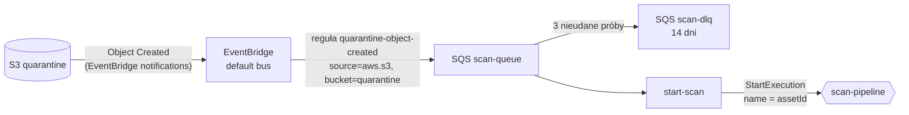

# `pipeline-start-scan` — start pipeline'u skanowania

Most między zdarzeniem S3 a maszyną stanów. Odbiera z kolejki SQS komunikaty „Object Created” z bucketu kwarantanny i dla każdego uruchamia wykonanie Step Functions `scan-pipeline`. **Nie zawiera logiki skanowania**: kolejność kroków, ponowienia i obsługę błędów zna maszyna stanów (ADR 0005).

| | |
|---|---|
| Funkcja AWS | `matchday-dam-dev-start-scan` |
| Wyzwalacz | SQS `matchday-dam-dev-scan-queue` (event source mapping: paczki do 10, max 2 równoległe wywołania, `ReportBatchItemFailures`) |
| Rola IAM | `dam-start-scan` |
| Pamięć / timeout | 128 MB / 30 s |
| Zmienne | `STATE_MACHINE_ARN`, `QUARANTINE_BUCKET` |
| Kod | [`src/main.rs`](src/main.rs), parsowanie zdarzenia w [`src/event.rs`](src/event.rs) |
| Terraform | `infra/modules/scanner/pipeline.tf` (`module "start_scan"`, `aws_lambda_event_source_mapping.start_scan`) |

## Skąd przychodzi komunikat

Dlaczego kolejka między EventBridge a Lambdą? Bufor przy wielu uploadach naraz, kontrola równoległości (`maximum_concurrency = 2`), automatyczne ponowienia i DLQ na komunikaty, których nie da się obsłużyć.

## Działanie

Dla każdego rekordu w paczce:

1. **Parsowanie** (`event::parse`): ciało komunikatu to zdarzenie EventBridge. Akceptowane jest tylko `detail-type = "Object Created"` z kluczem w formacie UUID (klucze nadaje `upload-init`). Komunikat niepoprawny, innego typu albo z obcym kluczem jest **logowany i pomijany** (nie wraca do kolejki w nieskończoność).
2. **Bucket**: jeśli zdarzenie dotyczy innego bucketu niż kwarantanna → `Ignored`.
3. **`StartExecution`** z nazwą = `assetId` (`execution_name(asset_id, None)`) i wejściem `{"assetId": "…"}`.
4. Wynik:
   - `Started` — wykonanie ruszyło,
   - `Duplicate` — `ExecutionAlreadyExists`: to samo zdarzenie przyszło drugi raz (S3 i EventBridge dostarczają „co najmniej raz”). Komunikat jest usuwany, pipeline nie startuje drugi raz (scenariusz 13),
   - błąd AWS — `messageId` trafia do `batchItemFailures`, SQS ponowi tylko ten komunikat (po 3 próbach → DLQ).

Druga warstwa idempotencji jest w maszynie stanów: pierwszy stan `MarkScanning` zmienia status warunkowo `QUARANTINED → SCANNING`, więc nawet gdyby wykonanie wystartowało drugi raz, kończy się w `NotAwaitingScan`.

## Uprawnienia (`dam-start-scan-main`)

| Akcja | Zasób |
|---|---|
| `sqs:ReceiveMessage`, `sqs:DeleteMessage`, `sqs:GetQueueAttributes` | `scan-queue` |
| `states:StartExecution` | `scan-pipeline` |

Funkcja nie ma dostępu do S3 ani DynamoDB. Komunikat zawiera tylko referencję do obiektu (bucket, klucz, rozmiar), nigdy jego treść.

Do kolejki może pisać wyłącznie reguła EventBridge (polityka kolejki z `aws:SourceArn`), więc nikt nie wstrzyknie ręcznie fałszywego zdarzenia (STRIDE S2).

## Diagnostyka

- Asset utknął w `QUARANTINED` → sprawdź `scan-dlq` (output Terraform `scan_dlq_url`) i logi `/aws/lambda/matchday-dam-dev-start-scan`.
- Komunikaty ponownie do kolejki: `aws sqs start-message-move-task --source-arn <arn dlq>`.

## Testy

`parses_object_created`, `rejects_other_events_and_foreign_keys`, `ignores_objects_outside_quarantine`.
